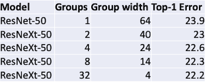

# 11 CNN Architectures II

> [FA2019 Lecture 7: Convolutional Networks](https://youtu.be/ANyxBVxmdZ0)

> [FA2019 Lecture 8: CNN Architectures](https://youtu.be/XaZIlVrIO-Q)

> [Lecture Slide 8: CNN Architectures I](https://web.eecs.umich.edu/~justincj/slides/eecs498/WI2022/598_WI2022_lecture08.pdf)

> [Lecture Slide 11: CNN Architectures II](https://web.eecs.umich.edu/~justincj/slides/eecs498/WI2022/598_WI2022_lecture11.pdf)

---

## 11.1 Batch Normalization

> [Batch normalization: Accelerating deep network training by reducing internal covariate shift 논문(2015)](https://arxiv.org/abs/1502.03167)

단일 레이어가 있을 때, 입력 $x$ 가 다음과 같은 특징을 갖는다고 하자.

$$y = Wx$$

- not centered at zero

- different scaling per-element

  이에 따라 가중치 행렬 W의 element가 가질 수 있는 값의 범위도 다양해진다.

이러한 특징으로 발생하는 문제(internal covariate shift)를 해결하기 위해, 레이어마다 batch 단위로 input activation을 scaling하는 **Batch Normalization**이 등장했다.

$$ \hat{x} = {{x - E[x]} \over {\sqrt{Var[x]}}} $$

- 평균 0, 단위 분산 1을 갖도록 normalize.

- differentiable function이므로, backpropagation이 가능하다.

---

### 11.1.1 Batch Normalization: Training

다음과 같은 입력 배치가 있다고 하자.

$x: N \times D$

- $N$ : 배치 크기

- $D$ : 벡터 하나의 크기

Batch Normalization은 다음과 같은 과정으로 진행된다.

1. Per-channel mean (shape: D)

$$ {\mu}_j = {1 \over N} \sum_{i=1}^{N} x_{i,j} $$

2. Per-channel std (shape: D)

$$ {\sigma}_j^2 = {1 \over N} \sum_{i=1}^{N} (x_{i,j} - {\mu}_j)^2 $$

3. Normalize (shape: N x D)

$$ \hat{x}_{i,j} = {{x_{i,j} - {\mu}_j} \over {\sqrt{{\sigma}_j^2 + \epsilon}}} $$

4. Output (shape: N x D)

    learnable parameter $\gamma$ , $\beta$ 를 도입한다.

    - $\gamma$ : scaling. 
    
      $\mu$ 역할을 하도록 학습한다.

    - $\beta$ : shifting. 
    
      $\sigma$ 역할을 하도록 학습한다.

$$ y_{i,j} = \gamma_j \hat{x}_{i,j} + \beta_j $$

하지만 minibatch를 이용한 학습이 전제가 되어야 하기 때문에, test time에서는 동일한 절차를 수행할 수 없다.

> 반면 Layer Normalization은 batch dimension 대신, channel dimension을 기준으로 normalization을 수행한다.

> $x: N \times D \rightarrow \mu , \sigma : N \times 1$

---

### 11.1.2 Batch Normalization: Test-Time

batch normalization을 적용한 모델은, test time에서 training 과정에서 계산한 평균과 분산을 고정하여 사용한다.

- input $x \in \mathbb{R}^{N \times D}$

- learnable parameter $\gamma , \beta \in \mathbb{R}^D$

test time에서 평균, 분산, normalized x, output을 다음과 같이 계산한다.

- Per-channel mean ${\mu}_j$ (shape: D)
  
  (Running) average of minibatch means

- Per-channel std ${\sigma}_j^2$ (shape: D)

  (Running) average of minibatch stds

- Normalized x

$$ \hat{x}_{i,j} = {{x_{i,j} - {\mu}_j} \over {\sqrt{{\sigma}_j^2 + \epsilon}}} $$

- Output

$$ y_{i,j} = \gamma_j \hat{x}_{i,j} + \beta_j $$

고정된 상수 값을 사용하기 때문에, test time에서 convolution layer와 BN layer를 fuse하면, 해당 과정을 zero-overhead로 수행할 수 있다.

---

### 11.1.3 Batch Normalization for ConvNets

convolutional network에서의 batch normalization 적용을, Fully-connected network와 비교하며 알아보자.

|| Fully-Connected | Convolutional |
| :---: | :---: | :---: |
|| $x: N \times D$ | $x: N \times C \times H \times W$ |
| normalize | $\downarrow$ | $\downarrow$ |
| $\mu , \sigma$ | $1 \times D$ | $1 \times C \times 1 \times 1$ |
| $\gamma , \beta$ | $1 \times D$ | $1 \times C \times 1 \times 1$ |
| $y$ | ${{(x - \mu)} \over {\sigma}}\gamma + \beta$ | ${{(x - \mu)} \over {\sigma}}\gamma + \beta$ |

---

### 11.1.4 Batch Normalization: Pros and Cons

> [Normalization is dead, long live normalization! 논문(2022)](https://openreview.net/forum?id=C9llY9kJJLL)

CNN과 Batch Normalization의 조합은 다음과 같은 장점을 갖는다.

- (+) 10개 이상의 레이어를 갖는 deep network를 학습하기 쉽다.

- (+) learning rate, initialization에 따른 영향을 최소화할 수 있다.

- (+) Regularization 효과를 갖는다.

- (+) 추론 과정에서 convolution layer와 fuse하면, 추가적인 연산이 필요하지 않다.

하지만 다음과 같은 단점도 갖는다.

- (-) batch size에 민감하다.

  - 특히 batch size가 작으면, 평균과 분산이 noisy하게 계산된다.

  - 가용한 하드웨어가 유한할 때, 모델 크기를 제한하는 원인이 될 수 있다.

- (-) train, test time이 서로 다른 statistics를 사용한다.(discrepancy)

- (-) 훈련 시간이 늘어난다.(memory overhead, gradient computation overhead)

- (-) 다른 regularization 방법과 잘 작동하지 않는다.(L2-regularization, dropout 등)

- (-) minibatch 내부 examples 사이의 independence를 깨뜨린다.

  - 반대로 minibatch examples 사이에 dependency가 있는 경우, 성능이 저하된다.

> [Cross-Backend Validation to Detect and Localize Bugs in Deep Learning Librarie 논문(2019)](https://www.cs.purdue.edu/homes/lintan/publications/cradle-icse19.pdf): 일부 프레임워크 + 분산 학습에서 BN 사용 시, 버그를 발생시키는 원인이 된다.

---

## 11.2 Grouped Convolution

(생략)

---

## 11.3 Improving ResNets: ResNeXt

> [Aggregated Residual Transformations for Deep Neural Networks 논문(2017)](https://arxiv.org/abs/1611.05431)

ResNeXt 논문에서는 ResNet의 Residual block을 multiple branch로 확장한다.

- parallel branch $G$ 개 (Group)

- branch마다 \#channels $c$ 를 갖는다.

|| Residual Block | ResNeXt block |
| :---: | :---: | :---: |
||  |  |
| FLOPs | $17HWC^2$ | $(8Cc + 9c^2) \times HWG$ |

computational complexity(FLOPs)를 동일하게 유지하면서도 정확도를 향상시킬 수 있다. 다음은 ResNet-50, ResNet-100과 ResNeXt를 비교한 결과다.

| ResNet50 vs ResNeXt50 | ResNet101 vs ResNeXt101 |
| :---: | :---: |
|  |  |

---

## 11.4 Squeeze-and-Excitation Networks (SENet)

> [Squeeze-and-Excitation Networks 논문(2017)](https://arxiv.org/abs/1709.01507)

위 논문에서는 Squeeze and Excite block을 이용해, convolution layer의 출력 채널별 중요도를 계산한 뒤 recalibration한다. 다음은 Residual Block에 SE block을 추가한 구조다.

- FLOPs: $8CHW + 2C^2 + 17C/4$

(생략)

---

## 11.5 MobileNets: Depthwise Separable

> [MobileNets: Efficient Convolutional Neural Networks for Mobile Vision Applications 논문(2017)](https://arxiv.org/abs/1704.04861)

(생략)

---

## 11.6 MobileNetV2: Inverted Bottleneck. Linear Residual

> [MobileNetV2: Inverted Residuals and Linear Bottlenecks 논문(2018)](https://arxiv.org/abs/1801.04381)

(생략)

---

## 11.7 ShuffleNet: Channel Shuffle

> [ShuffleNet: An Extremely Efficient Convolutional Neural Network for Mobile Devices 논문(2018)](https://arxiv.org/abs/1707.01083)

(생략)

---

## 11.8 EfficientNet: Model Scaling

> [EfficientNet: Rethinking Model Scaling for Convolutional Neural Networks 논문(2019)](https://arxiv.org/abs/1905.11946)

(생략)

---

## 11.9 NFNets: Remove Batch Normalization

> [Characterizing Signal Propagation to Close the Performance Gap in Unnormalized ResNets 논문(2021)](https://arxiv.org/abs/2101.08692)

> [High-Performance Large-Scale Image Recognition Without Normalization 논문(2021)](https://arxiv.org/abs/2102.06171)

NFNets(Normalizer-Free ResNets) 논문은 batch normalization를 사용하지 않고, 다른 접근법으로 기존 모델보다 더 좋은 정확도를 달성하는 방법을 소개한다. 

---

### 11.9.1 NFNets: Scaled Residual Block

논문에서는 몇 가지 방법을 통해 BN을 대체한다. 다음은 skip connection에 따른 variance 증가를 방지하기 위해 도입한 scaled residual block이다. 

> batch normalization + skip connection: activation scaling 역할을 하여 훈련이 원활해진다. NFNet에서는 이런 역할을 scalied residual block으로 수행한다.

|| Residual Block | Scaled Residual Block |
| :---: | :---: | :---: |
||  |  |
| Pre-activation | $x_{l+1} = f_l (x_l) + x_l$ | $x_{l+1} = x_l + \alpha f_l(x_l/{\beta}_l)$ |

- 기존 Residual Block

  블록을 거치면 거칠수록 variance가 커지게 된다.

  $$ Var(x_{l+1}) = Var(x_l) + Var(f_l(x_l)) $$

- Scaled Residual Block

  re-parameterize를 통한 scaling으로, variance의 증가를 막는다.

  - $\alpha$ : scaling factor

  - ${\beta}_l$ : initialization 시 계산되는 패러미터. $\sqrt{Val(x_l)}$

  > 두 하이퍼패러미터는 훈련 시 모두 상수로 고정된다.

  $$x_{l+1} = x_l + \alpha f_l(x_l/{\beta}_l)$$

  variance는 다음과 같이 변화한다.

  > 각 downsampling block을 거칠 때마다, $1+{\alpha}^2$ 로 초기화된다.

  $$ Var(x_{l+1}) = Var(x_l) + {\alpha}^2 $$

---

### 11.9.2 NFNets: Weight Standardization

BFNets에서는 (activation을 normalize한 BN과 다르게) weight를 직접 normalize하는 **Weight Standardization**을 도입한다. 학습 중 $\hat{W}$ 를 두고, backpropagation 과정을 거치며 업데이트를 반복한다.

$$ \hat{W}_{i,j} = \gamma \cdot {{W_{i,j} - mean(W_i)} \over {std(W_i)\sqrt{N}}} $$

- $W_i$ : 단일 convolution filter

- $N$ : filter의 "fan-in" ( $=K^2C_{in}$ )

- $\gamma$ : nonlinearity에 의한 영향을 보정하여, variance를 보존하는 scale factor

  예를 들어 ReLU를 사용할 경우, $\gamma$ 는 다음과 같다.

$$ \gamma = \sqrt{2/(1-(1/\pi))} $$

> 추론 과정에서는 fixed $\hat{W}$ 를 사용한다. (BN과 마찬가지로 zero-overhead)

---

### 11.9.3 NFNets: Other Tricks

NFNets에서는 몇 가지 방법을 추가로 도입한다.

- **Adaptive Gradient Clipping**

  gradient norm이 일정 threshold를 넘어가면, gradient를 clpping한다.

- **Tweak ResNet Architecture**

  - SE-ResNeXt를 기반으로, stem과 downsampling block을 변경한다.

  - ReLU를 GELU로 변경한다.

  - 모든 레이어의 group size를 128로 고정한다.

  - stage widths를 변경한다.

    $[256, 512, 1024, 1024] \rightarrow [256, 512, 1536, 1536]$

  - stage depths를 변경한다.

    $[3, 4, 6, 3] \rightarrow [1, 2, 6, 3]$

- **Stronger Regularization**

  MixUp, RandAugment, CutMix, DropOut, Stochastic Depth와 같은 regularization 기법을 사용한다.

---

### 11.9.3 NFNets: Experiments

이러한 방법을 통해 NFNets는 훨씬 빠른 훈련 속도와 높은 정확도를 달성한다.

> 그래프 x축 metric에 유의해야 한다.

> FLOPs, Params, Test-time runtime, Training-time runtime, Runtime on CPU/GPU/TPU 등

---

## 11.10 Revisiting ResNets

> [Revisiting ResNets: Improved Training and Scaling Strategies 논문(2021)](https://arxiv.org/abs/2103.07579)

Revisiting ResNets 논문은, 다양한 training, scaling 기법을 적용했을 때의 ResNet 정확도 변화를 분석한 논문이다. 다음은 논문에서 baseline으로 사용한 ResNet 구조다.

- initial width: 0.25, 0.5, 1.0, 1.5, 2.0

- overall depth: 26, 50, 101, 200, 300, 350, 400

- input resolution: 128, 160, 224, 320, 448

다음은 ResNet-200 기준에서 다양한 변형에 따른 정확도 변화를 기록한 표이다.

---

## 11.11 RegNets: Designing Network Design Spaces

> [Designing Network Design Spaces 논문(2020)](https://arxiv.org/abs/2003.13678)

RegNets 논문은 network design space를 re-design하는 방식으로, 보다 성능이 좋은 모델을 찾아내는 방법을 소개한다.

- design space $A$ 에서 시작하여, 적은 error를 갖는 모델로 구성된 최적의 design space $C$ 를 찾는다.

---

### 11.11.1 ResNet Design Space

ResNet을 기반으로 한 design space는, 각 stage에서 4가지 structural parameter를 갖는다.

- \#blocks (depth) $d$

- \#input channels (width) $w$

- bottleneck ratio $b$

- group width $g$

> 총 4개 stage를 가지므로 design space는 16개 패러미터(Degree of Freedom)로 구성된다. 

논문에서는 ResNet 기반 design space에서 random search를 통한 500개 모델 생성 후, error rate를 시각화하여 design space의 성능을 측정한다.

| EDF | depth $d$ | stage 4 width $w_4$ |
| :---: | :---: | :---: |
|  |  |  |
| 500개 모델 훈련 후 error distribution 측정 (Design Space Quality) | 블록 수(depth)에 따른 error 분포 | 출력 채널 수(width)에 따른 error 분포 |

> 하늘색: 95% confidence를 갖는 best model을 포함하는 구간

> EDF: Empirical Distribution Function

---

### 11.11.2 Shared Bottleneck Ratio, Shared Group Width

RegNets은 ResNet design space를 분석한 결과에서 직관을 얻어, 다음과 같이 design space를 단순화한다.

- shared bottleneck ratio

  - 모든 stage $i$ 에서, bottleneck ratio $b$ 를 공유

  - DoF: 16개 패러미터에서 13개 패러미터로 줄어든다.

- shared group width

  - 모든 stage $i$ 에서, group width $g$ 를 공유

  - DoF: 13개 패러미터에서 10개 패러미터로 줄어든다.

다음은 shared bottleneck ratio, shared group width를 적용한 design space의 error EDF를 시각화한 결과다. error EDF의 변화가 없는 것을 알 수 있다.

> $X_b$ : shared bottleneck ratio, $X_c$ : shared bottleneck ratio + shared group width

---

### 11.11.3 Linear Parameterization of Width and Depth

다음은 shared bottleneck ratio와 shared group width의 여러 조합을 탐색한 결과다.

> 파란색: good combination, 주황색: bad combination

결과를 보면, $w_{i+1} > w_{i}$ 일 때, 우수한 design space를 갖는다는 것을 알 수 있다. 이러한 관찰을 바탕으로, RegNets에서는 width, depth를 묶어 linear parameterization을 적용한다.

$$u_j = w_0 + w_a \cdot j$$

- $w_a$ : slope

- $w_0$ : initial width

- $j$ : depth ( $0 \le j < d$ )

- DoF: 10개 패러미터에서 6개 패러미터로 줄어든다.

---

### 11.11.4 RegNets Design Space

최종적으로 **RegNet**은 6개 패러미터를 기반으로 한 design space로 구성된다.

- overall depth $d$ 

- shared bottleneck ratio $b$ 

- shared group width $g$

- initial width $w_0$ 

- width growth rate $w_a$

- depth $w_m$

---

## 11.12 ACNet: Asymmetric Convolution Block(ACB)

> [ACNet: ACNet: Strengthening the Kernel Skeletons for Powerful CNN via Asymmetric Convolution Blocks 논문(2019)](https://arxiv.org/abs/1908.03930)

ACNet은 세 종류의 parallel conv layer로 훈련 후 추론 시 병합하는, assymetric convolution block을 도입하였다.

| Training | | Inference |
| :---: | :---: | :---: |
|  | | 
| 3x1 conv + 1x3 conv + 3x3 conv | →  | 3x3 conv |

이때 1x3 convolution, 3x1 convolution은 다음과 같은 장점으로, 3x3 convolution에서 캡처하지 못하는 특징을 파악할 수 있다.

- (+) 1x3 conv: 3x3 conv보다 up-down flipping에 robust하다.

  

- (+) 3x1 conv: 3x3 conv보다 left-right flipping에 robust하다.

---

### 11.12.1 Additivity of Convolution

2D convolution은 kernel size가 달라도 결합이 가능하다.

> $H$ , $W$ 는 달라도 되지만, $D$ 는 동일할 필요가 있다.

$$ I * K^{(1)} + I * K^{(2)} = I * (K^{(1)} \oplus K^{(2)}) $$

- $\oplus$ : element-wise addition

- 단, $I$ 에 clipping 혹은 padding이 필요할 수 있다.

이때 ACNet은 3x3 convolution의 skeleton를 기준으로 element-wise addition을 적용한다.

---

### 11.12.2 BN Fusion, Branch Fusion

훈련 후 BN fusion, branch fusion 과정을 통해, 세 종류의 convolution을 결합한 단일 convolution 레이어를 얻는다.

1. kernel과 bias 항을 분리한다.

    

2. (**BN Fusion**) kernel과 batch norm을 하나의 convolution으로 fuse한다.

    

3. (**Branch Fusion**) fused kernel 항과 bias 항을 각각 세 종류의 conv과 합산 후, 최종적으로 kernel 항과 bias 항을 fuse한다.

    

---

### 11.12.3 Skeletons of Squara Kernels

ResNet-56을 대상으로 한 pruning에서, border와 skeletons을 동일한 비율로 제거한다면 skeleton으로 손상되는 정확도가 더 크다.

> 3x3 kernel의 4/9 = 44.4%이므로, sparsity ratio가 44.4%라면 네 모서리에서 대부분의 weight를 제거했다는 뜻이다.

이러한 결과는 skeleton weights의 중요성을 시사한다. 따라서 ACNet은 asymmetric convolution block을 통해 skeleton을 강화한다.

| Skeleton | Border |
| :---: | :---: |
|  |  |

다음은 여러 기준에서 asymmetric kernel을 합산했을 때, ACNet의 pruning에 따른 정확도 손실을 나타낸 그래프다.

- skeleton(주황색)에서 제일 큰 정확도 손실을 보인다.

- corner(파란색)에서 제일 작은 정확도 손실을 보인다.

---

## 11.13 RepVGG: VGG-like Inference body

> [RepVGG: Making VGG-style ConvNets Great Again 논문(2021)](https://arxiv.org/abs/2101.03697)

RepVGG는 ResNet 기반 모델이 갖는 다음과 같은 단점에 주목한다.

- multi-branch 

  - (-) latency
  
  - (-) memory utilization

- blocks (depthwise convolution, channel shuffle, ...)

  - (-) memory access cost

  - (-) hardware support

RepVGG는 훈련 시 3x3, 1x1, identity branch로 구성된 VGG-like 모델을 사용하고, 추론 시 단일 3x3 convolution과 ReLU만으로 구성된 모델로 변환한다.(**re-parameterization**)

| Training | | Inference |
| :---: | :---: | :---: |
|  | | 

---

### 11.13.1 RepVGG block 

RepVGG block에서는 skip connection에서 영감을 받아, 1x1 convolution을 이용한 shortcut을 도입한다.

$$ y = g(x) + f(x) $$

- $g(x)$ : 1x1 conv로 구현된 convolutional shortcut

이때 입력과 출력 차원이 일치하는 경우, identity layer를 추가하여 기존 skip connection과 비슷한 형태로 만든다.

$$ y = x + g(x) + f(x) $$

이때 주의할 점은, block 내 레이어는 각각의 batch normalization parameter를 갖는다.

- 3x3 conv

  - kernel: $W^{(3)}$

  - BN parameters: ${\mu}^{(3)}, {\sigma}^{(3)}, {\gamma}^{(3)}, {\beta}^{(3)}$

- 1x1 conv

  - kernel: $W^{(1)}$

  - BN parameters: ${\mu}^{(1)}, {\sigma}^{(1)}, {\gamma}^{(1)}, {\beta}^{(1)}$

- identity

  - BN parameters: ${\mu}^{(0)}, {\sigma}^{(0)}, {\gamma}^{(0)}, {\beta}^{(0)}$

---

### 11.13.2 Structural Re-parameterization

다음은 branch를 하나의 3x3 convolution으로 병합하는 re-parameterization 과정을 순차적으로 나타낸 그림이다.

1. 1x1 conv, identity branch: 3x3 conv로 변환한다.

    - conv + bn: 하나의 convolution으로 fuse한다.

    $$W_i = {{\gamma}_i \over {\sigma}_i} W_i , \quad b_i = - {{{\mu}_i{\gamma}_i} \over {\sigma}_i}+{\beta}_i$$

    - zero-padding을 통해 3x3 convolution 형태로 변환한다.

    

2. 모든 3x3 conv branch을 합산하여, 단일 conv 레이어로 만든다.

    

---

### 11.13.3 RepVGG vs ACNet

RepVGG 논문에서는 다른 structural re-parameterization 방법을 사용하는 ACNet과 비교하여, 동일한 패러미터 수 기준에서 우수한 성능을 달성한다.

> 위: RepVGG 변형, 아래: 다른 structural re-parameterization 방법

> Residual Reorganizing: RepVGG + skip connection 버전

---
