# 4 Optimization

> [Lecture 4: Optimization](https://youtu.be/YnQJTfbwBM8?si=33f-_K6SiiyVdSeq)

> [Optimization in Deep Learning: AdaGrad, RMSProp, ADAM](https://artemoppermann.com/optimization-in-deep-learning-adagrad-rmsprop-adam/)

> [Gradient Descent Part 2: The Math](https://medium.com/analytics-vidhya/gradient-descent-part-2-the-math-c23060a96a13)

본격적으로 들어가기 앞서 일반적인 **linear classifier**에서의 **loss function**을 복습해 보자.

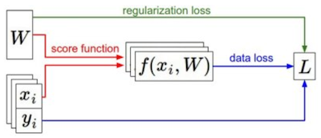

- dataset $(x,y)$

- score function $s$

  linear classifier에서 식은 다음과 같다.

$$ s = f(x; W) = Wx $$

- regularization loss $R$ 을 추가하여 일반화를 돕는다.

- Loss function $L$

$$ {1 \over N} \sum_{i=1}^{N}L_i + R(W) $$

그렇다면 어떻게 최적의 $W$ 값을 찾을 수 있을까?

---

## 4.1 Optimization

loss function을 최소화하는 과정을 **optimization**(최적화)라고 한다. 이러한 최적화 과정은 다음과 같이 수식으로 표현할 수 있다.

$$ w^{*} = \mathrm{arg}{\min}_{w} L(w) $$

이러한 loss function은 gradient $W$ 에 관한 식으로 볼 수 있으며, gradient를 구하는 대표적인 방법은 크게 **numeric gradient**와 **analytic gradient**로 나뉜다.

---

### 4.1.1 Numeric Gradient

먼저 다음과 같이 경사의 derivative(도함수)를 계산하여 최적의 $w$ 값을 찾는다고 하자.

$$ {{df(x)} \over {dx}} = \lim_{h \rightarrow 0} {{f(x+h) - f(x)} \over {h}} $$

1. 가중치 행렬 $W$ 가 다음과 같다고 하자.

   이를 입력으로 한 loss는 1.25347이라고 가정한다.

$$ [0.34, -1.11, 0.78, 0.12, 0.55, 2.81, -3.1, -1.5, 0.33, \cdots] $$

2. h=0.0001을 더하여 $W+h$ loss한다.

   먼저 dimension 1의 값인 0.34 값에 대해서만 계산해 보자.

$$ 0.34 + 0.0001 $$

3. gradient $dL/dW$ 는 다음과 같다.

$$ {{df(x)} \over {dx}} = {{1.25322 - 1.25347} \over {0.0001}} = -2.5 $$

$$ {{dL} \over {dW}} = [-2.5, ?, ?, ?, ?, ?, ?, ?, ?, \cdots]$$

따라서 나머지 모든 dimension 값까지 계산한다면, 시간 복잡도는 O(\#dimensions)가 된다. 문제는 모델이 갖는 학습 가능한 parameters 수가 굉장히 많을 수 있기 때문에, 이러한 계산을 모두 수행하려면 너무 많은 시간이 소요된다.

---

### 4.1.2 Analytic Gradient

따라서 이러한 문제를 해결하기 위해 **analytic gradient**를 사용한다. 이는 backpropagation 과정에서 **chain rule**을 통해 구현할 수 있다.(lecture 06 참조)

따라서 모든 과정에서 훨씬 효율적으로 계산할 수 있는 analytic gradient를 사용하지만, 특성상 error가 발생할 수 있다. 따라서 구현 시 numeric gradient를 사용하여 오류를 확인하는 **gradient check** 과정을 거치는 것이 좋다.

---

## 4.2 Gradient Descent

이제 최적의 $w$ 를 구하기 위한 계산 과정인 **gradient descent**를 살펴보자.

- 세 가지 hyperparameters가 등장한다.

  - weight initialization method

  - number of steps

  - learning rate

```python
w = initialize_weights()
for t in range(num_steps):
    dw = compute_gradient(loss_fn, data, w)
    w -= learning_rate * dw
```

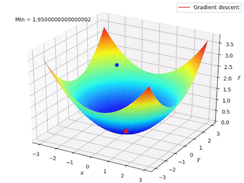

- 경사가 급할수록 gradient가 커지므로 step size가 크다.

- 평편한 바닥에 접근할수록 gradient가 작아지므로 step size가 작다.

---

### 4.2.1 Batch Gradient Descent

그런데 지금까지 살펴본 gradient descent는 (full) **Batch Gradient Descent**에 해당된다. loss function은 데이터셋에 있는 <U>모든 데이터의 loss function을 합한 함수</U>로 정의된다.

$$ L(W) = {{1} \over {N}}\sum_{i=1}^{N}L_i(x_i, y_i, W) + \lambda R(W) $$

- gradient는 다음과 같이 정의된다.

```math
{\nabla}_W L(W) = {{1} \over {N}}\sum_{i=1}^{N}{\nabla}_WL_i(x_i, y_i, W) + \lambda {\nabla}_W R(W)
```

모든 데이터 $N$ 개에서, single step마다 이만큼의 연산을 수행하는 것은 굉장히 비효율적이다. 특히 거대한 데이터셋을 사용할수록 연산 비용이 엄청나게 증가하게 될 것이다.

---

### 4.2.2 Stochastic Gradient Descent

따라서 연산량을 줄이고 효율적으로 loss function을 갱신하는 **Stochastic Gradient Descent**(SGD)가 등장했다. SGD는 데이터셋에서 샘플링한 **minibatch** 단위만으로 loss function을 계산한다.(approximate sum)

> 보통 minibatch size로는 32, 64, 128를 사용하는데, 가능한 한 큰 minibatch size를 사용하는 경향이 있다.

- 다섯 가지 hyperparameters가 등장한다.

  - weight initialization method

  - number of steps

  - learning rate

  - **batch size**

  - **data sampling**

```Python
w = initialize_weights()
for t in range(num_steps):
    minibatch = sample_data(data, batch_size)
    dw = compute_gradient(loss_fn, minibatch, w)
    w -= learning_rate * dw
```

따라서 sampling한 minibatch를 바탕으로 계산한 loss function은 이제 기대값으로 정의된다.

```math
L(W) = {\mathbb{E}}_{(x,y)~p_{data}}[L(x,y,W)] + \lambda R(W)
```

```math
{\nabla}_W L(W) = {\nabla}_W {\mathbb{E}}_{(x,y)~p_{data}}[L(x,y,W)] + \lambda {\nabla}_W R(W)
```

---

#### 4.2.2.1 Problems with SGD

하지만 학습 중 loss가 어떤 방향으로는 급격하게 변화하고, 또 다른 방향에서는 거의 변화가 없는 경우가 발생할 수 있다. 예를 들어  다음과 같이 loss function이 y축 방향으로 민감하게 변화하면, gradient descent 과정에서 **overshoot**이 발생한다.

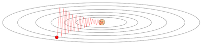

이러한 문제는 다른 말로 loss function이 큰 **condition number**를 갖는다고 표현한다. 여기서 condition number란 작은 변화에 대해 loss function이 얼마나 변화하는지를 뜻한다.

> 물론 step size를 줄이면 overshoot을 줄일 수 있겠지만, 그만큼 학습 속도가 느려지는 trade-off가 발생한다.

게다가 SGD는 gradient가 0이 되는 **saddle points**나 **local minima**에 빠지면(stuck) 그대로 학습이 끝나게 될 위험이 크다.

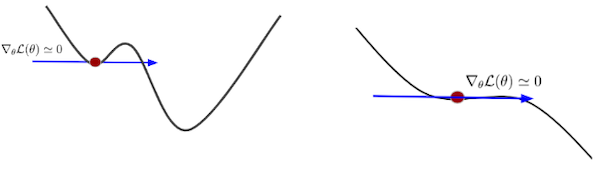

> 좌: local minima, 우: saddle points

> 예시는 2차원이지만, 실제로 더 고차원에서 훨씬 일반적으로 발생하는 문제이다.

게다가 minibatch를 바탕으로 계산한 gradient는 noise가 있거나 variance가 클 수 있다. 이러한 noise는 학습이 수렴하는 데 굉장한 지연 요소가 될 수 있다.

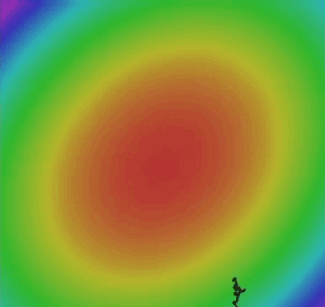

---

## 4.3 SGD + Momentum

SGD가 가진 문제를 해결하기 위해 **momentum**을 함께 쓰는 방법이 등장했다.

> 운동량 momentum 대신 충격량 impulse로 표현하기도 한다.

- SGD

$$ x_{t+1} = x_t - \alpha \nabla f(x_t) $$

- SGD + Momentum

  gradient의 running mean에 해당되는 **velocity** 개념을 도입한다.

  - $\rho$ : friction coefficient(마찰 계수)

  - $\alpha$ : learning rate

$$ v_{t+1} = \rho v_t + \nabla f(x_t) $$

$$ x_{t+1} = x_t - \alpha v_{t+1} $$

Python 코드로 나타내면 다음과 같다.

```python
v = 0
for k in range(num_steps):
    dw = compute_gradient(w)
    v = rho * v + dw
    w -= learning_rate * v
```

참고로 아래와 같이  SGD + Momentum를 다르게 정의할 수 있다. 겉보기에는 다르나 실제로는 동일한 식이다.

$$ v_{t+1} = \rho v_t - \alpha \nabla f(x_t) $$

$$ x_{t+1} = x_t + v_{t+1} $$

Python 코드로 나타내면 다음과 같다.

```python
v = 0
for k in range(num_steps):
    dw = compute_gradient(w)
    v = rho * v - learning_rate * dw
    w += v
```

아래는 SGD(검정색)과 SGD+momentum(파란색)의 gradient descent 과정을 시각화한 그림이다. momentum이 있기 때문에 saddle points나 local minima에 빠지지 않고 계속해서 학습이 진행된다.

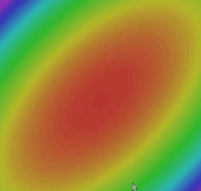

---

### 4.3.1 Nesterov Momentum

> [네스테로프 모멘텀 비교 정리](https://velog.io/@cha-suyeon/DL-%EC%B5%9C%EC%A0%81%ED%99%94-%EC%95%8C%EA%B3%A0%EB%A6%AC%EC%A6%98)

이처럼 SGD+Momentum을 결합한 방식에서는, 다음과 같이 진행할 velocity(actual step)를 얻게 된다.

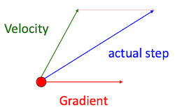

- velocity: gradient의 running mean

- 그런데 지금까지 누적된 velocity가 너무 크다면 overshooting이 발생할 수 있다. 

따라서 이와 다르게 **Nesterov Momentum**은, (1) 기존까지 누적된 velocity $v_t$ 와 (2) $v_t$ 로 1 step 더 update된 weight matrix를 가지고, 진행할 velocity(actual step) $v_{t+1}$ 을 구한다.

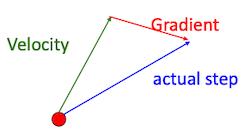

$$ v_{t+1} = \rho v_t - \alpha \nabla f(x_t) $$

$$ \downarrow $$

$$ v_{t+1} = \rho v_t - \alpha \nabla f(x_t + \rho v_t) $$

기존 momentum과 Nesterov momentum의 차이를 비교해 보자.

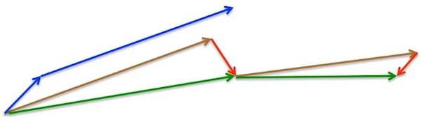

- 기존 momentum

  - 파란색 벡터: standard momentum

- Nesterov momentum

  - 갈색 벡터: 이전에 구한 velocity(gradient의 running mean)를 바탕으로 먼저 크게 jump한다.

  - 빨간색 벡터: 계산한 gradient

  - 초록색 벡터: jump한 위치에서 gradient를 빼는 방식으로 다음 velocity $v_{t+1}$ 를 도출한다.

참고로 Nesterov momentum은 보통 다음과 같이 치환하여 사용한다.

```math
\tilde{x_t} = x_t + \rho v_t$$
```

치환한 식을 다시 정리하면 다음과 같다.

```math
v_{t+1} = \rho v_t - \alpha \nabla f({\tilde{x}}_t)
```

```math
\tilde{x}_{t+1} = \tilde{x}_{t} - \rho v_t + (1 + \rho) v_{t+1}
```

```math
= \tilde{x}_{t} + v_{t+1} + \rho(v_{t+1} - v_t)
```

---

## 4.4 AdaGrad

**AdaGrad**는 **learning rate**를 adaptive하게 조절하는 접근법으로 여러 문제를 해결한다.(Adaptive Gradient의 약자)

```Python
grad_squared = 0
for t in range(num_steps):
    dw = compute_gradient(w)
    grad_squared += dw * dw
    w -= learning_rate * dw / (grad_squared.sqrt() + 1e-7)
```

- gradient가 크게 변했다면, 그만큼 learning rate는 작게 조절된다.

  다시 말해 경사가 급하게 변하는 구간은 학습 속도를 줄인다.(dampen)

- gradient가 작게 변했다면, 그만큼 learning rate는 크게 조절된다.

  다시 말해 경사가 완만하게 변하는 구간은 학습 속도를 높인다.(accelerate)

이처럼 learning rate를 조절할 수 있다면, 평평한 구간에서 학습 속도를 향상시키며 **divergence**(발산)를 방지할 수 있다.

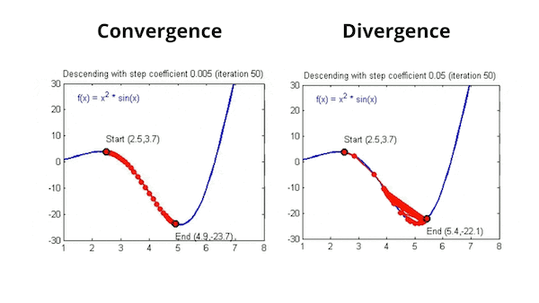

---

## 4.5 RMSProp

또 다른 최적화 알고리즘인 **RMSProp**은 AdaGrad의 leaky 버전에 해당된다.

> 아래 예시 코드에서 주석 표시가 되어 있는 부분만 AdaGrad와 다르다.

```Python
grad_squared = 0
for t in range(num_steps):
    dw = compute_gradient(w)
    grad_squared = decay_rate * grad_squraed + (1 - decay_rate) * dw * dw   # RMSProp
    w -= learning_rate * dw / (grad_squared.sqrt() + 1e-7)
```

SGD, SGD+momentum, RMSProp의 특징을 비교해 보자.

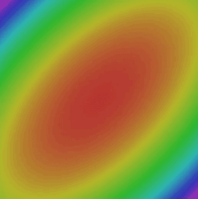

- 검은색: SGD

- 파란색: SGD+momentum

   SGD+momentum 방식이 제일 빠르게 global minimum을 찾지만, 훨씬 더 긴 경로를 통해 찾아가기 때문에 local minimum에 빠질 위험이 크다. 

- 빨간색: RMSProp

   우회 없이 global minimum을 향한다.

---

## 4.6 Adam

> [ADAM : A METHOD FOR STOCHASTIC OPTIMIZATION 논문(2014)](https://arxiv.org/abs/1412.6980)

**Adam**은 momentum과 RMSProp을 합친 방식이다. 한번 두 방법을 합친 코드를 작성해 보자.

- beta1( ${\beta}_1$ )

  momentum의 Exponential Moving Average(EMA)

- beta2( ${\beta}_2$ )

  RMSProp의 Exponential Moving Average(EMA)

```Python
moment1 = 0
moment2 = 0
for t in range(1, num_steps + 1):    # start at t = 1
    dw = compute_gradient(w)
    moment1 = beta1 * moment1 + (1 - beta1) * dw           # Momentum
    moment2 = beta2 * moment2 + (1 - beta2) * dw * dw      # AdaGrad / RMSProp
    w -= learning_rate * moment1 / (moment2.sqrt() + 1e-7)
```

그런데 여기서 주의할 점으로, 만약 첫 초기화( $t=0$ )에서 beta2가 0.999을 갖는다고 가정해보자. 이 경우, weight update 과정에서 0에 가까운 값으로 나누게 된다.

따라서 Adam에서는 추가로 **bias correction** 과정을 수행한다. 계산에 $t$ 가 포함되는 것에 주목하자.

- bias correction

   $t=0$ 에서 moment1, moment2가 0으로 초기화되지 않도록 만든다.

```Python
moment1 = 0
moment2 = 0
for t in range(1, num_steps + 1):
    dw = compute_gradient(w)
    moment1 = beta1 * moment1 + (1 - beta1) * dw
    moment2 = beta2 * moment2 + (1 - beta2) * dw * dw
    moment1_unbias = moment1 / (1 - beta1 ** t)    # bias correction
    moment2_unbias = moment2 / (1 - beta2 ** t)    # bias correction
    w -= learning_rate * moment1_unbias / (moment2_unbias.sqrt() + 1e-7)
```

> Adam에서는 beta1로 0.9, beta2로 0.999를 주로 사용한다. 동시에 초기 learning rate는 1e-3, 5e-4, 1e-4 중 하나로 주로 설정한다.

다음은 Adam을 이용한 gradient descent 과정을 시각화한 그림이다. Adam이 momentum과 RMSProp 두 가지 방법의 특징을 모두 갖는 것을 확인할 수 있다.

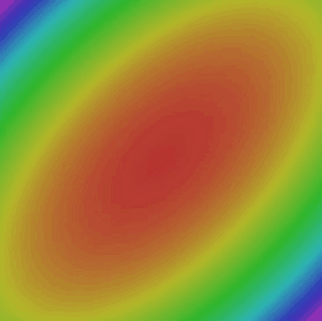

- 검정색: SGD

- 파란색: SGD+momentum

- 빨간색: RMSProp

- 보라색: Adam

---

## 4.6 Second-Order Optimization

> [최적화 기법의 직관적 이해](https://darkpgmr.tistory.com/149): 2차 미분, 다차원 미분을 이용한 최적화

4.5절까지의 optimization은 first-order optimization에 해당된다. 그런데 1차 도함수와 함께 2차 도함수를 사용하는 second-order optimization 방법으로도 최적화 과정에서 발생하는 여러 문제를 해결할 수 있다.

- First-Order Optimization

   1차 도함수를 사용한다. loss function이 특정 값에서 증가/감소하는지를 알 수 있다.

  

- Second-Order Optimization

   2차 도함수를 사용한다.(quadratic = 2차) 따라서 특정 값에서의 '1차 도함수'가 증가/감소하는지를 알 수 있다.

   > quadratic: 2차 함수 / Hessian: 2차 도함수(Hessian Matrix는 2차 도함수를 행렬로 표현한 것)

사실 SGD+momentum이나 Adagrad와 같은 방법을, second-order optimization의 diagonal approximation으로도 볼 수 있다. Second-Order Optimization 역시 훨씬 빠른 수렴 속도를 가질 수 있다.

> 게다가 스스로 step size를 결정하기 때문에, 하이퍼패러미터인 learning rate를 따로 설정할 필요가 없다.

> 단, 주의할 점이라면 2차 최적화에서는 대체로 stochastic한 방법이 잘 작동하지 않는다.

Second-Order Optimization은 곡률(curvature)에 따라 양상이 달라진다. 크게 두 가지 양상을 살펴보자.

- high curvature

  approximation을 최소화하기 위해 작은 step size가 필요하다.

  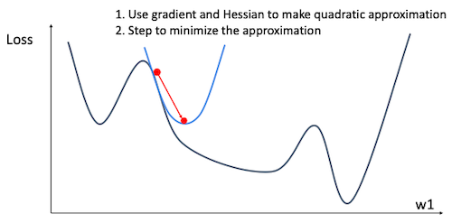

- low curvature

  approximation의 최소화를 위해서 큰 step size가 필요하다.

  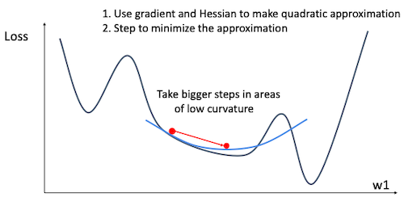

---

### 4.6.1 Space Complexity of Second-Order Optimization

그렇다면 실제 계산 과정은 어떻게 진행될까? 이차 미분을 이용한 최적화 방법으로는 대표적으로 뉴턴법(Newton's Method), 가우스-뉴턴법(Gauss-Newton Method), LM(Levenberg–Marquardt algorithm) 등이 있었다.

> 아래 계산 과정을 보면 알 수 있겠지만, 해결해야 하는 문제가 많아서 실제로는 잘 사용하지 않는다.

먼저 loss function의 Second-Order Taylor Expansion은 다음과 같다.

$$ L(w) \approx L(w_0) + (w - w_0)^{\mathsf{T}} {\nabla}_w L(w_0) + {1 \over 2}(w-w_0)^{\mathsf{T}} H_w L(w_0) (w-w_0) $$

- $H_w$ : Hessian

  기존 weight matrix가 갖는 원소가 N개라면, Hessian Matrix가 갖는 원소는 $N^2$ 개이다.

뉴턴법으로 parameter update 식을 표현하면 다음과 같다.

$$ w^{*} = w_0 - H_w L(w_0)^{-1} {\nabla}_w L(w_0) $$

즉, parameter update를 계산할 때, Hessian의 공간 복잡도 $O(N^2)$ 가 발목을 잡게 된다. 더 심각한 점은 Hessian의 역행렬을 계산(inverting)해야 하는데, 이 또한 $O(N^3)$ 공간 복잡도를 갖는다. 

> 현재 엄청난 패러미터 수를 갖는 모델의 학습이 주류가 되고 있는 만큼, 이러한 계산은 불가능에 가까우며 설령 가능해도 낭비가 너무 심하다.

---

## 4.7 In practice

실전에서 최적화 과정을 진행할 때는 다음을 권장한다.

- Adam이 대부분의 경우에서 잘 작동하는 default optimizer이다.

  간혹 SGD+Momentum 방법이 Adam의 성능을 넘을 때도 있지만, 이를 실현하기 위해서는 hyperparameter tuning 과정이 필요하다.

- stochastic이 아닌 full batch updates가 필요할 경우, **L-BFGS**(Limited Memory BFGS) 알고리즘의 사용을 권장한다.

  예를 들어 Second-Order Optimization은 full batch updates를 사용해야 잘 작동한다.

> BFGS는 개발자 이름의 앞글자를 딴 것이다. 가장 인기 있는 Quasi-Newton(준뉴턴) 방법 중 하나로, $n \times n$ Hessian 행렬을 그대로 사용하지 않고, 근사한 $n$ 차원의 벡터로 대체하여 계산량을 줄인다.

---