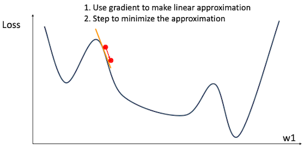

# 4 Optimization

> [Lecture 4: Optimization](https://youtu.be/YnQJTfbwBM8?si=33f-_K6SiiyVdSeq)

> [Optimization in Deep Learning: AdaGrad, RMSProp, ADAM](https://artemoppermann.com/optimization-in-deep-learning-adagrad-rmsprop-adam/)

본격적으로 들어가기 앞서, 일반적인 **linear classifier**를 위한 **loss function** 설계를 복습해 보자.

| | score function | loss function |
| :---: | :---: | :---: |
|  | $s = f(x; W) = Wx$ <br/>(linear classifier) | ${1 \over N} \sum_{i=1}^{N}L_i + R(W)$ |

> $(x,y)$ : dataset , $R$ : regularization term

> $L_i = -\log{{e^{s_{y_i}} \over {\sum_{j}e^{s_j}}}}$ (softmax)

---

## 4.1 Computing Gradient

최적의 $W$ 를 찾기 위해, loss function을 최소화하는 과정을 **optimization**(최적화)라고 한다.

$$ w^{*} = \mathrm{arg}{\min}_{w} L(w) $$

그리고 이를 효율적으로 최소화하기 위해서는 미분 값 ${\nabla}_w L$ 를 계산해야 한다. 이때 기울기를 계산하는 방식은, 크게 **numeric gradient**(수치 미분)와 **analytic gradient**(해석적 미분)로 나뉜다.

| computing | (+) | (-) |
| :---: | --- | --- |
| **Numeric Gradient** | easy to implement | approximate, slow | 
| **Analytic Gradient** | exact, fast | error-prone |

>실제 학습에서는 analytic gradient를 사용하지만, numerical gradient로 재차 확인하는 **gradient check** 과정을 거친다.

---

### 4.1.1 Numeric Gradient

> [Python Numerical Methods: Finite Difference Approximating Derivatives](https://pythonnumericalmethods.studentorg.berkeley.edu/notebooks/chapter20.02-Finite-Difference-Approximating-Derivatives.html)

> (1-Dimensional) 주어진 함수의 미분을 계산하는 방법: perturbation을 추가한 뒤, loss의 변화량을 계산한다.
>
> $$ {{df(x)} \over {dx}} = \lim_{h \rightarrow 0} {{f(x+h) - f(x)} \over {h}} $$

다음 가중치 행렬과 손실 함수 예시를, Numeric Gradient 방식으로 계산해 보자. (첫 번째 차원만)

<table>
<tr>
<th> 

현재 가중치 행렬 $W$ 

</th> 
<th> 

$W+h$ (first dim) 

</th> 
<th> 

gradient $dL/dW$ 

</th>
</tr>
<tr>
<th> 

$\begin{bmatrix} 0.34 \\ -1.11 \\ 0.78 \\ 0.12 \\ 0.55 \\ 2.81 \\ -3.1 \\ -1.5 \\ 0.33 \\ \vdots \end{bmatrix}$

</th> 
<th> 

$\begin{bmatrix} 0.34 + \boldsymbol{0.0001} \\ -1.11 \\ 0.78 \\ 0.12 \\ 0.55 \\ 2.81 \\ -3.1 \\ -1.5 \\ 0.33 \\ \vdots \end{bmatrix}$

</th>
<th> 

$\begin{bmatrix} \boldsymbol{-2.5} \\ ? \\ ? \\ ? \\ ? \\ ? \\ ? \\ ? \\ ? \\ \vdots \end{bmatrix}$

</th>
</tr>
<tr>
<th> 

loss = 1.25347

</th> 
<th> 

loss = 1.25322

</th> 
<th> 


</th>
</tr>
</table>

> ${{df(x)} \over {dx}} = {{1.25322 - 1.25347} \over {0.0001}} = -2.5$

하지만, 다음과 같은 두 가지 문제를 갖는다.

- (-) 나머지 모든 차원에서 이러한 계산을 반복한다면, 시간 복잡도는 O(\#dimensions)이다. (즉, 매우 느려서 실용적이지 않다.) 

- (-) 계산 과정에서 유한 차분법(finite difference methods)를 사용하므로, approximation error가 발생한다.

  

---

### 4.1.2 Analytic Gradient

혹은, 수학적으로 함수의 미분식을 활용하는 **analytic gradient** 방식을 사용할 수 있다. 

<table>
<tr>
<th> 

현재 가중치 행렬 $W$ 

</th> 
<th> 

$dL/dW = ...$

</th> 
<th> 

gradient $dL/dW$ 

</th>
</tr>
<tr>
<th> 

$\begin{bmatrix} 0.34 \\ -1.11 \\ 0.78 \\ 0.12 \\ 0.55 \\ 2.81 \\ -3.1 \\ -1.5 \\ 0.33 \\ \vdots \end{bmatrix}$

</th> 
<th> 

some function data and $W$

</th>
<th> 

$\begin{bmatrix} -2.5 \\ 0.6 \\ 0 \\ 0.2 \\ 0.7 \\ -0.5 \\ 1.1 \\ 1.3 \\ -2.1 \\ \vdots \end{bmatrix}$

</th>
</tr>
</table>

> 자세한 계산은 lecture 6 참조(backpropagation을 통해 analytic gradient를 계산하는 방법을 다룬다.)

---

## 4.2 Gradient Descent

> 최소값으로 향하는 과정은, negative gradient 방향을 갖고 이동하게 된다.

이제 최적의 $w$ 를 구하기 위한 방법인 **gradient descent**(경사 하강법)을 알아보자. 경사 하강법이란 반복적으로 최소값을 향해 나아가는(iteratively step) 최적화 방법이다. 


> - 경사가 급할수록 gradient size가 크다 = step size가 크다. 
>
> - 반면, 평탄한 바닥에 가까울수록 gradient size가 작아진다 = step size가 작다.

이때, 경사 하강법을 계산하는 데이터 단위에 따라, 경사 하강법은 크게 두 가지 방법으로 분류된다.

---

### 4.2.1 Full Batch Gradient Descent

1 step에서, 전체 데이터셋( $N$ 개 입력 데이터 )을 대상으로 구한 손실의 평균으로 gradient를 계산한다. 이를 **(Full)** **Batch Gradient Descent**라고 한다.

$$ L(W) = {{1} \over {N}}\sum_{i=1}^{N}L_i(x_i, y_i, W) + \lambda R(W) $$

```math
{\nabla}_W L(W) = {{1} \over {N}}\sum_{i=1}^{N}{\nabla}_WL_i(x_i, y_i, W) + \lambda {\nabla}_W R(W)
```

다음은 batch gradient descent을 구현한 코드 예시다.

<table>
<tr>
<td> Vanilla Gradient Descent Implementation (code) </td> <td> Hyperparameters </td>
</tr>
<tr>
<td> 

```python
w = initialize_weights()
for t in range(num_steps):
    dw = compute_gradient(loss_fn, data, w)
    w -= learning_rate * dw
```

</td> 
<td> 

  - weight initialization method

  - number of steps

  - learning rate

</td>
</tr>
</table>

하지만 이러한 방식은, 거대한 데이터셋을 사용할수록 1 step을 위한 계산 비용이 굉장히 증가하게 된다.

---

### 4.2.2 Stochastic Gradient Descent

따라서, 1 step마다 **mini-batch** 단위에서 구한 손실의 평균으로 기울기를 계산하는, **Stochastic Gradient Descent**(확률적 경사 하강법, SGD)가 등장했다.

다음은 확률적 경사 하강법을 구현한 코드 예시다.

<table>
<tr>
<td> Vanilla Gradient Descent Implementation (code) </td> <td> Hyperparameters </td>
</tr>
<tr>
<td> 

```Python

w = initialize_weights()
for t in range(num_steps):
    minibatch = sample_data(data, batch_size)
    dw = compute_gradient(loss_fn, minibatch, w)
    w -= learning_rate * dw

```

</td> 
<td> 

  - weight initialization method

  - number of steps

  - learning rate

  - (new) **batch size**

  - (new) **data sampling**

</td>
</tr>
</table>

이때 minibatch 단위로 계산한 loss는, 전체 데이터 분포 $p_{data}$ 에서의 **expectation**(기댓값)에 해당된다.

```math
\begin{align} L(W) & = \mathbb{E} {}_{(x,y) \sim p_{data}} \left[ L(x,y,W) \right] + \lambda R(W) \\ & \approx {{1} \over {N}}\sum_{i=1}^{N}L_i(x_i, y_i, W) + \lambda R(W) \end{align}
```

```math
\begin{align} {\nabla}_W L(W) & = {\nabla}_W {\mathbb{E}}_{(x,y) \sim p_{data}} \left[ L(x,y,W) \right] + \lambda {\nabla}_W R(W) \\ & \approx {{1} \over {N}}\sum_{i=1}^{N}{\nabla}_WL_i(x_i, y_i, W) + \lambda {\nabla}_W R(W) \end{align}
```

---

### 4.2.3 Problems with SGD: Overshooting

만약 SGD에서, loss가 어떤 방향으로는 급격하게 변화하지만, 다른 방향에서는 변화량이 거의 없다면 어떻게 될까?

- 예를 들어, 다음과 같이 loss가 y축 방향에서 급격한 변화가 일어난다고 가정하자. 

  | loss 변화 | 발생하는 문제 |
  | --- | --- |
  |  | y축 방향으로 jitter 현상이 일어난다.(overshooting) <br/> $\rightarrow$ 동선 낭비로, 최적 해를 찾기 위해 필요한 \#step이 늘어난다. |

> 달리 말하면, loss function이 큰 **condition number**를 갖는다고 할 수 있다. 
>
> > condition number란, 작은 변화에 대해 loss function이 얼마나 변화할 수 있는지를 측정한 수치다.

step size를 줄여서 overshooting 문제를 방지할 수 있지만, 그만큼 학습 속도가 느려지는 trade-off 문제를 고려해야 한다.

---

### 4.2.4 Problems with SGD: Local Minima

SGD의 특성상, 계산한 기울기 값이 0이 되는 **local minima**나 **saddle points**에 갇힐(stuck) 위험이 크다.

| local minima | saddle points |
| :---: | :---: |
|  |  |

> 예시는 2차원이지만, 고차원에서 훨씬 일반적으로 발생하는 문제이다.

게다가, minibatch를 사용해 계산한 기울기는 대체로 noisy한 특성을 가진다. 이러한 경우 최적화 과정에서 최소값을 향해 직선 형태로 나아가지 않고, 다음 그림처럼 지그재그와 같은 형태로 나아가게 된다.


따라서, SGD가 가진 문제를 해결하기 위한 다양한 **Optimizer**가 등장했다.

---

## 4.3 Optimizer: SGD + Momentum

> [On the importance of initialization and momentum in deep learning 논문(2013)](https://proceedings.mlr.press/v28/sutskever13.html)

먼저 대표적으로, SGD에 **momentum**을 도입하는 방법이 등장했다. 기울기의 running mean에 해당되는 **velocity** 개념을 도입한다.

<table>
<tr>
<td> SGD </td> <td> SGD+Momentum </td>
</tr>
<tr>
<td> 

$x_{t+1} = x_t - \alpha \nabla f(x_t)$

</td> 
<td>

$v_{t+1} = \rho v_t + \nabla f(x_t)$

$x_{t+1} = x_t - \alpha v_{t+1}$
 
</td>
</tr>
<tr>
<td> 

```python

for k in range(num_steps):
    dw = compute_gradient(w)
    w -= learning_rate * dw

```

</td> 
<td> 

```python
v = 0
for k in range(num_steps):
    dw = compute_gradient(w)
    v = rho * v + dw
    w -= learning_rate * v
```

</td>
</tr>
</table>

> $\rho$ : friction coefficient(마찰 계수, 주로 0.9나 0.99 사용), $\alpha$ : learning rate

아래는 SGD(검정색)과 SGD+momentum(파란색)의 gradient descent 과정을 비교한 그림이다. 


<blockquote>

참고로, SGD+momentum은 두 가지 방식으로 구현할 수 있다. (수식적으로 동일)

<table>
<tr>
<td> SGD+Momentum </td> <td> SGD+Momentum </td>
</tr>
<tr>
<td> 

$v_{t+1} = \rho v_t - \alpha \nabla f(x_t)$

$x_{t+1} = x_t + v_{t+1}$

</td> 
<td>

$v_{t+1} = \rho v_t + \nabla f(x_t)$

$x_{t+1} = x_t - \alpha v_{t+1}$
 
</td>
</tr>
<tr>
<td> 

```python
v = 0
for k in range(num_steps):
    dw = compute_gradient(w)
    v = rho * v - learning_rate * dw
    w += v
```

</td> 
<td> 

```python
v = 0
for k in range(num_steps):
    dw = compute_gradient(w)
    v = rho * v + dw
    w -= learning_rate * v
```

</td>
</tr>
</table>

</blockquote>

---

### 4.3.1 Nesterov Momentum

> [네스테로프 모멘텀 비교 정리](https://velog.io/@cha-suyeon/DL-%EC%B5%9C%EC%A0%81%ED%99%94-%EC%95%8C%EA%B3%A0%EB%A6%AC%EC%A6%98)

> 일반 SGD에서는 누적된 velocity(기울기의 running mean)가 계산된 기울기 값에 비해 클 경우, overshooting 문제가 발생할 수 있다. 

다음은 일반 momentum과 **Nesterov Momentum**의 차이를 비교한 그림이다.

- **Nesterov**: '기존 속도 x 마찰 계수로 한 걸음 미리 가본' 위치의 gradient vector를 사용한다.

  > 즉, overshooting이 된 만큼 다시 되돌아가는 방법이다.

<table>
<tr>
<td> Momentum update </td> <td> Nesterov Momentum </td>
</tr>
<tr>
<td> 


</td> 
<td>


 
</td>
</tr>
<tr>
<td> 

$v_{t+1} = \rho v_t + \nabla f(x_t)$

$x_{t+1} = x_t - \alpha v_{t+1}$

</td> 
<td> 

$v_{t+1} = \rho v_t + \nabla f(x_t + \boldsymbol{\rho v_t})$

$x_{t+1} = x_t - \alpha v_{t+1}$

</td>
</tr>
</table>

<blockquote>

참고로 Nesterov momentum 식에 $\tilde{x_t} = x_t + \rho v_t$ 치환을 적용하면, 다음과 같이 표현할 수 있다.

```math
v_{t+1} = \rho v_t - \alpha \nabla f({\tilde{x}}_t)
```

```math
\tilde{x}_{t+1} = \tilde{x}_{t} - \rho v_t + (1 + \rho) v_{t+1}
```

```math
= \tilde{x}_{t} + v_{t+1} + \rho(v_{t+1} - v_t)
```

</blockquote>

---

## 4.4 Optimizer: AdaGrad

**AdaGrad**는 모든 파라미터가 동일한 학습률을 갖는 SGD와 달리, 각 파라미터 단위로 **adaptive한 학습률**을 갖는다.

$$g_{t+1} = g_t + (\nabla f(x_t))^2$$

$$x_{t+1} = x_t - {{\eta} \over {\sqrt{g_t + \epsilon}}} \cdot \nabla f(x_t)$$

> 경사가 빈번하게 바뀌는 feature는 학습률이 빠르게 감소하고, 경사가 드물게 바뀌는 feature는 학습률이 느리게 감소한다.

>  $\eta$ : 학습률,  $\epsilon$ : 분모가 0이 되는 것을 방지하기 위한 작은 상수

다음은 AdaGrad를 구현한 코드 예시다.

```Python
grad_squared = 0
for t in range(num_steps):
    dw = compute_gradient(w)
    grad_squared += dw * dw
    w -= learning_rate * dw / (grad_squared.sqrt() + 1e-7)
```

---

## 4.5 Optimizer: RMSProp

**RMSProp**은 $g_t$ 가 무한히 커지는 문제를 방지하기 위한, AdaGrad의 leaky 버전에 해당된다.

<table>
<tr>
<td> AdaGrad </td> <td> RMSProp </td>
</tr>
<tr>
<td> 

$g_{t+1} = g_t + (\nabla f(x_t))^2$

$x_{t+1} = x_t - {{\eta} \over {\sqrt{g_t + \epsilon}}} \cdot \nabla f(x_t)$

</td> 
<td>

$g_{t+1} = \gamma g_t + (1 - \gamma) (\nabla f(x_t))^2$

$x_{t+1} = x_t - {{\eta} \over {\sqrt{g_t + \epsilon}}} \cdot \nabla f(x_t)$
 
</td>
</tr>
<tr>
<td> 

```Python
grad_squared = 0
for t in range(num_steps):
    dw = compute_gradient(w)
    grad_squared += dw * dw
    w -= learning_rate * dw / (grad_squared.sqrt() + 1e-7)
```


</td> 
<td> 

```Python
grad_squared = 0
for t in range(num_steps):
    dw = compute_gradient(w)
    grad_squared = decay_rate * grad_squared + (1 - decay_rate) * dw * dw
    w -= learning_rate * dw / (grad_squared.sqrt() + 1e-7)
```

</td>
</tr>
</table>

> $\gamma$ : $g_t$ 가 점차 작아지도록 하는 decay rate

다음은 SGD(검은색), SGD+momentum(파란색), RMSProp(빨간색)의 gradient descent 과정을 비교한 그림이다. 

- SGD+momentum: 제일 빠르게 global minimum을 찾지만, 훨씬 더 긴 경로를 통하면서 도중에 local minimum에 빠질 위험이 크다. 

- RMSProp: 우회 없이 global minimum을 향한다.


---

## 4.6 Optimizer: Adam

> [ADAM : A METHOD FOR STOCHASTIC OPTIMIZATION 논문(2014)](https://arxiv.org/abs/1412.6980)

**Adam**은 momentum과 RMSProp을 결합한 optimizer이다. (Adaptive Moment Estimation)

$$v_{t+1} = {\beta}_1 v_t - (1 - {\beta}_1) \cdot \nabla f(x_t)$$

$$s_{t+1} = {\beta}_2 s_t - (1 - {\beta}_2) \cdot {( \nabla f(x_t))}^2$$

$$x_{t+1} = x_t - {\eta}{{v_{t+1}} \over {\sqrt{s_{t+1} + \epsilon}}} \cdot \nabla f(x_t)$$

> ${\beta}_1$ : momentum의 Exponential Moving Average(EMA), ${\beta}_2$ : RMSProp의 Exponential Moving Average(EMA)

> $s$ : 기울기 제곱값(square)의 Exponential Moving Average(EMA)

그러나, 위 식의 분모 계산에 주의해야 한다. 

- 가령 첫 초기화( $t=0$ )에서 ${\beta}_2=0.999$ 라고 가정하면, 0에 가까운 값으로 나누는 문제가 발생한다.

- 위 문제를 해결하기 위해, **bias correction**을 추가한다. (식에 포함된 $t$ 에 주목)

  > $t=0$ 에서 moment1, moment2가 0으로 초기화되지 않도록 만든다.

다음은 Adam을 구현한 예시 코드다.

<table>
<tr>
<td> bias correction 전 </td> <td> bias correction 후 </td>
</tr>
<tr>
<td> 

```Python
moment1 = 0
moment2 = 0
for t in range(1, num_steps + 1):    # start at t = 1
    dw = compute_gradient(w)
    moment1 = beta1 * moment1 + (1 - beta1) * dw           # Momentum
    moment2 = beta2 * moment2 + (1 - beta2) * dw * dw      # AdaGrad / RMSProp
    w -= learning_rate * moment1 / (moment2.sqrt() + 1e-7)


```

</td> 
<td> 

```Python
moment1 = 0
moment2 = 0
for t in range(1, num_steps + 1):
    dw = compute_gradient(w)
    moment1 = beta1 * moment1 + (1 - beta1) * dw
    moment2 = beta2 * moment2 + (1 - beta2) * dw * dw
    moment1_unbias = moment1 / (1 - beta1 ** t)    # bias correction
    moment2_unbias = moment2 / (1 - beta2 ** t)    # bias correction
    w -= learning_rate * moment1_unbias / (moment2_unbias.sqrt() + 1e-7)
```

</td>
</tr>
</table>

> beta1로 0.9, beta2로 0.999를 주로 사용하며, 초기 learning rate는 1e-3, 5e-4, 1e-4를 주로 사용한다.

다음은 Adam을 이용한 gradient descent 과정을 시각화한 그림이다. 

- SGD: 검정색, SGD+momentum: 파란색, RMSProp: 빨간색, Adam: 보라색

- Adam: momentum과 RMSProp 두 optimizer의 특징을 모두 갖는다.


---

## 4.7 Second-Order Optimization

> 4.6절까지는 first-order optimization에 해당된다.

> [최적화 기법의 직관적 이해](https://darkpgmr.tistory.com/149): 2차 미분, 다차원 미분을 이용한 최적화

> quadratic: 2차 함수 / Hessian: 2차 도함수 (Hessian Matrix는 2차 도함수를 행렬로 표현한 것)

경우에 따라, 2차 도함수를 활용한 second-order optimization의 여러 이점을 활용할 수 있다.

| First-Order Optimization | Second-Order Optimization |
| :---: | :---: |
|  |  |
| 손실의 증가/감소를 알 수 있다. | 1차 도함수의 증가/감소를 알 수 있다. |

Second-Order Optimization은 곡률(curvature)에 따라, 두 가지 양상으로 나뉜다.

| high curvature | low curvature |
| :---: | :---: |
|  |  |

> 단, 주의할 점이라면 second-order optimization에서는 stochastic한 최적화가 잘 작동하지 않는다.

---

### 4.7.1 Space Complexity of Second-Order Optimization

이차 미분을 이용한 최적화 방법에서는, 대표적으로 뉴턴법(Newton's Method), 가우스-뉴턴법(Gauss-Newton Method), LM(Levenberg–Marquardt algorithm) 등의 알고리즘을 사용해 계산한다.

다음은 loss function의 Second-Order Taylor Expansion이다.

$$ L(w) \approx L(w_0) + (w - w_0)^{\mathsf{T}} {\nabla}_w L(w_0) + {1 \over 2}(w-w_0)^{\mathsf{T}} H_w L(w_0) (w-w_0) $$

> $H_w$ : Hessian 
>
> > 참고로 기존 weight matrix가 갖는 원소가 N개라면, Hessian Matrix가 갖는 원소는 $N^2$ 개이다.

뉴턴법으로 parameter update 식을 표현하면 다음과 같다.

$$ w^{*} = w_0 - H_w L(w_0)^{-1} {\nabla}_w L(w_0) $$

여기서 다음과 같은 계산 비용을 고려해야 한다. (모델이 가진 파라미터 수가 많을수록 불리)

- Hessian의 공간 복잡도 $O(N^2)$

- Hessian의 역행렬을 계산(inverting) 시, $O(N^3)$ 공간 복잡도를 갖는다. 

---

## 4.8 In practice

다음은 실전에서 최적화 파트를 설계할 때 참고할 팁이다.

- 대부분의 경우에서 잘 작동하는 default optimizer는 **Adam**이다.

  간혹 SGD+Momentum 방법이 Adam의 성능을 능가하지만, 하이퍼파라미터 튜닝에 큰 노력을 들여야 한다.

- (stochastic이 아닌) full batch 단위의 update일 경우, **L-BFGS**(Limited Memory BFGS) 알고리즘의 사용을 권장한다.

  > 예를 들어, Second-Order Optimization은 full batch updates가 권장된다.

  > BFGS는 가장 인기 있는 Quasi-Newton(준뉴턴) 방법 중 하나로, $n \times n$ Hessian 행렬을 그대로 사용하지 않고, $n$ 차원의 벡터로 근사하여 계산량을 줄인다. (연구자 이름의 앞글자를 딴 명칭)

---