# 9 Deep Learning Software

> [Lecture 9: Hardware and Software](https://www.youtube.com/watch?v=oXPX8GIOiU4&list=PL5-TkQAfAZFbzxjBHtzdVCWE0Zbhomg7r&index=9)

> [slides - Lecture 12: Deep Learning Software](https://web.eecs.umich.edu/~justincj/slides/eecs498/WI2022/598_WI2022_lecture12.pdf)

대표적인 딥러닝 프레임워크는 다음과 같은 예시가 있다.

- Caffe(UC Berkely) $\rightarrow$ Caffe2(Facebook)

- Torch(NYU/Facebook) $\rightarrow$ PyTorch(Facebook)

- Theano(University of Montreal) $\rightarrow$ Tensorflow(Google)

- PaddlePaddle(Baidu)

- MXNet(Amazon)

- JAX(Google)

- CNTK(Microsoft)

본 정리에서는 PyTorch와 TensorFlow에 초점을 맞춘다.

---

## 9.1 The points of Deep Learning Frameworks

Deep Learning(DL) 프레임워크는 3가지 핵심 기능을 제공해야 한다.

- 편리한 common layer, utilities 등의 기능을 제공한다.

- gradients 계산을 자동으로 수행한다.

- GPU나 TPU를 활용해 효율적으로 연산을 수행할 수 있다.

여기서 gradients 계산은 다음과 같이 Computational graph를 구현하여 수행하게 된다.

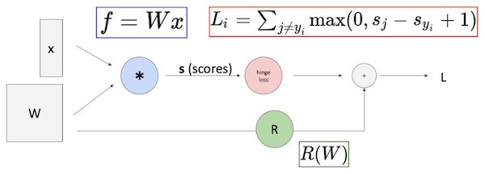

- forward pass

- backward pass

- update

---

## 9.2 PyTorch: Fundamental Concepts

> 1.10 버전을 기준으로 작성

PyTorch에서 제일 기본적인 기능은 세 가지로 요악할 수 있다.

- Tensor

  numpy array와 비슷하지만, GPU에서도 사용할 수 있다.

  > Tensor API만으로도 네트워크 구성, gradients 계산, parameter update 등을 수행할 수 있다.

  > NCHW format을 사용한다. [(NCHW와 관련해서는 정리 참조)](https://github.com/erectbranch/TinyML_and_Efficient_DLC/tree/master/lec17)

- Autograd

  자동으로 computational graph를 만들어 주며, gradients를 계산해준다.

- Module

  신경망의 layer를 의미한다. 대체로 state나 learnable weights를 가진다.

---

## 9.3 PyTorch: Tensor

> [PyTorch Docs: Tensor](https://pytorch.org/tutorials/beginner/basics/tensorqs_tutorial.html)

Tensor를 사용하기 위해서는 다음과 같이 initialize하면 된다.

```Python
# 1. Direct from data
data = [[1, 2], [3, 4]]
x_data = torch.tensor(data)

# 2. From a NumPy array
np_array = np.array(data)
x_np = torch.from_numpy(np_array)

# 3. From another tensor
x_ones = torch.ones_like(x_data)     # retains the properties of x_data

x_rand = torch.rand_like(x_data)     # overrides the datatype of x_data
```

자주 사용하는 tensor 문법 세 가지를 살펴보자.

```Python
# 1. tuple 형태의 shape를 정의한다.
shape = (2,3,)

# 2. Tensor를 생성한다.
rand_tensor = torch.rand(shape)
ones_tensor = torch.ones(shape)
zeros_tensor = torch.zeros(shape)
```

> 참고로 PyTorch에서 Tensor는 autimatic differentiation을 위해 optimize된다.

> PyTorch는 arithmetic, linear algebra, matrix manipulation (transposing, indexing, slicing), sampling 등 100개가 넘는 tensor operation을 지원한다.

다음은 Tensor operation만으로 수동으로 모든 훈련 과정을 구현한 예시 코드다.

- `torch.mm`: matrix multiplication

- 옵션을 추가하지 않으면(`.to`, `.device`), **tensor는 기본적으로 CPU에서 생성된다.**

  > CPU와 GPU 사이의 data communication의 비용을 고려하기 때문

```Python
import torch

# cpu: torch.device('cpu')
# gpu: torch.device('cuda:0')
device = torch.device('cuda:0')

# 임의의 Tensors를 생성한다. 
# (x,y) 데이터와 weights(w1,w2)
N, D_in, H, D_out = 64, 1000, 100, 10
x = torch.randn(N, D_in, device=device)    # GPU 연산을 위해 device에 생성해야 한다.
y = torch.randn(N, D_out, device=device)
w1 = torch.randn(D_in, H, device=device)
w2 = torch.randn(H, D_out, device=device)

learning_rate = 1e-6
for t in range(500):
    # forward pass
    # pred와 loss를 계산한다.
    h = x.mm(w1)    # N x H
    h_relu = h.clamp(min=0)
    y_pred = h_relu.mm(w2)  # N x D_out
    loss = (y_pred - y).pow(2).sum()

    # backward pass
    # gradient를 계산한다.
    grad_y_pred = 2.0 * (y_pred - y)
    grad_w2 = h_relu.t().mm(grad_y_pred)
    grad_h_relu = grad_y_pred.mm(w2.t())
    grad_h = grad_h_relu.clone()
    grad_h[h < 0] = 0
    grad_w1 = x.t().mm(grad_h)

    # update weights(gradient descent step)
    w1 -= learning_rate * grad_w1
    w2 -= learning_rate * grad_w2
```

---

## 9.4 PyTorch: Autograd

위 예시에서 Autograd를 이용하면 자동으로 gradients를 계산하게 만들 수 있다.

```Python
import torch

N, D_in, H, D_out = 64, 1000, 100, 10
# 데이터인 (x,y)는 gradient 계산이 필요하지 않다.
x = torch.randn(N, D_in)
y = torch.randn(N, D_out)
# weight인 w1,w2는 gradient 계산이 필요하다.
# Autograd 적용을 위해서 'requires_grad=True' 옵션을 추가한다.
w1 = torch.randn(D_in, H, requires_grad=True)
w2 = torch.randn(H, D_out, requires_grad=True)

learning_rate = 1e-6
for t in range(500):
    # forward pass
    # backpropagation를 위한 intermediate values를 굳이 저장할 필요가 없다.
    # (PyTorch가 알아서 graph에 값을 보관한다.)
    y_pred = x.mm(w1).clamp(min=0).mm(w2)
    loss = (y_pred - y).pow(2).sum()

    # backward pass
    # requires_grad=True로 설정한 모든 Tensors에서
    # 입력에 대한 gradient 계산을 수행한다.
    loss.backward()

    # backward가 끝나면 gradient는 w1.grad, w2.grad에 저장된다.
    # 동시에 graph는 destroy된다.
    # with torch.no_grad(): 해당 연산에서는 graph를 build하지 않는다.
    with torch.no_grad():
        w1 -= learning_rate * w1.grad
        w2 -= learning_rate * w2.grad

        # 끝난 뒤 gradient를 다시 0으로 초기화해야 버그가 일어나지 않는다.
        w1.grad.zero_()
        w2.grad.zero_()
```

예시 코드를 도식화하여 살펴보자.

- forward pass

  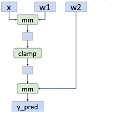

  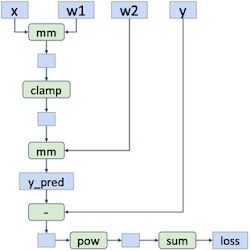

- backward pass

  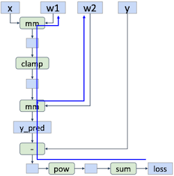

- update

  backward가 끝나서 graph가 destroy된다.

  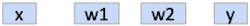

---

## 9.5 PyTorch: New Functions

이번에는 계산 과정 중 새로운 함수를 정의해서 사용해 보자. 먼저 다음과 같은 sigmoid를 정의한다.

```Python
def sigmoid(x):
    return 1.0 / (1.0 + (-x).exp())
```

이제 정의한 sigmoid를 사용하는 네트워크를 구성해 보자.

```Python
import torch

N, D_in, H, D_out = 64, 1000, 100, 10
x = torch.randn(N, D_in)
y = torch.randn(N, D_out)
w1 = torch.randn(D_in, H, requires_grad=True)
w2 = torch.randn(H, D_out, requires_grad=True)

learning_rate = 1e-6
for t in range(500):
    y_pred = sigmoid(x.mm(w1)).mm(w2)
    loss = (y_pred -y).pow(2).sum()

    loss.backward()
    if t % 50 == 0:
        print(t, loss.item())

    with torch.no_grad():
        w1 -= learning_rate * w1.grad
        w2 -= learning_rate * w2.grad
        w1.grad.zero_()
        w2.grad.zero_()
```

graph는 다음과 같다.

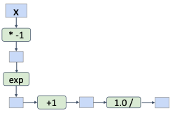

만약 subclassing을 통해 새로운 autograd function을 정의하고 싶다면, 다음과 같이 forward와 backward를 함께 구현하면 된다.

```Python
class Sigmoid(torch.autograd.Function):
    @staticmethod
    def forward(ctx, x):
      y = 1.0 / (1.0 + (-x).exp())
      ctx.save_for_backward(y)
      return y

    @staticmethod
    def backward(ctx, grad_y):
      y, = ctx.save_tensors
      grad_x = grad_y * y * (1.0 - y)
      return grad_x

def sigmoid(x):
  return Sigmoid.apply(x)
```

이제 기존의 graph는 다음과 같이 하나의 function으로 대체할 수 있다.

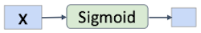

하지만 이렇게까지 구현해야 하는 경우는 드물고, 대부분 파이썬에서 기본으로 제공하는 함수를 사용해서 새로운 함수를 구현하면 된다.

```Python
def sigmoid(x):
  return 1.0 / (1.0 + (-x).exp())
```

---

## 9.6 PyTorch: nn

PyTorch에서는 쉽게 신경망을 구성할 수 있는, Object-oriented(객체 지향) API인 `nn` 모듈을 제공한다.

- 모든 패러미터는 `parameters()` 혹은 `named_parameters()` 메서드로 접근이 가능하다.

  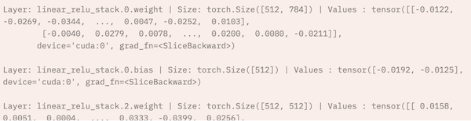

```Python
import torch

N, D_in, H, D_out = 64, 1000, 100, 10
x = torch.randn(N, D_in)
y = torch.randn(N, D_out)

# Object-oriented API
# 레이어 객체는 각자의 weight tensors를 갖는다.
model = torch.nn.Sequential(
            torch.nn.Linear(D_in, H),
            torch.nn.ReLU(),
            torch.nn.Linear(H, D_out))

learning_rate = 1e-2
for t in range(500):
    # forward
    # loss functions를 구현할 때, torch.nn.functional을 사용하면 편리하다.(이외에도 다양하게 사용)
    y_pred = model(x)
    loss = torch.nn.functional.mse_loss(y_pred, y)

    # backward(requires_grad=True 대상 gradient 계산)
    loss.backward()

    # 각 model parameter에 대해 gradient step을 수행한다.
    with torch.no_grad():
        for param in model.parameters():
            param -= learning_rate * param.grad
    model.zero_grad()
```

---

## 9.7 PyTorch: optim

> [PyTorch Docs: optim](https://pytorch.org/docs/stable/optim.html)

또한 나만의 gradient descent 규칙을 구현하는 과정이 번거롭기 때문에, PyTorch에서는 쉽게 사용할 수 있는 `optim` 모듈을 제공한다.

> `optimizer.param_groups[0]["lr"]` 코드를 통해 현재 learning rate를 확인할 수 있다. 

```Python
import torch

N, D_in, H, D_out = 64, 1000, 100, 10
x = torch.randn(N, D_in)
y = torch.randn(N, D_out)

model = torch.nn.Sequential(
                              torch.nn.Linear(D_in, H),
                              torch.nn.ReLU(),
                              torch.nn.Linear(H, D_out))

learning_rate = 1e-4
# optimizer(Adam 사용)
# 인자로 최적화할 패러미터 전달(여기서는 model parameter를 최적화)
# 동시에 learning rate도 필요하므로 전달한다.
optimizer = torch.optim.Adam(model.paramters(),
                             lr=learning_rate)

for t in range(500):
  y_pred = model(x)
  loss = torch.nn.functional.mse_loss(y_pred, y)

  loss.backward()

  # backward가 끝나면(gradient 계산이 끝나면) 최적화를 수행한다.(step)
  # 또한 gradient를 0으로 초기화하여 버그를 방지한다.
  optimizer.step()
  # print(optimizer.param_groups[0]["lr"])    # 현재 learning rate 확인
  optimizer.zero_grad()
```

---

### 9.7.1 PyTorch: optim.lr_scheduler

> [PyTorch Learning rate scheduler 정리](https://sanghyu.tistory.com/113)

> [A Visual Guide to Learning Rate Schedulers in PyTorch](https://towardsdatascience.com/a-visual-guide-to-learning-rate-schedulers-in-pytorch-24bbb262c863)

PyTorch에서는 총 epoch 수에 따라서 learning rate를 조절하는 `lr_scheduler` 기능을 제공한다.

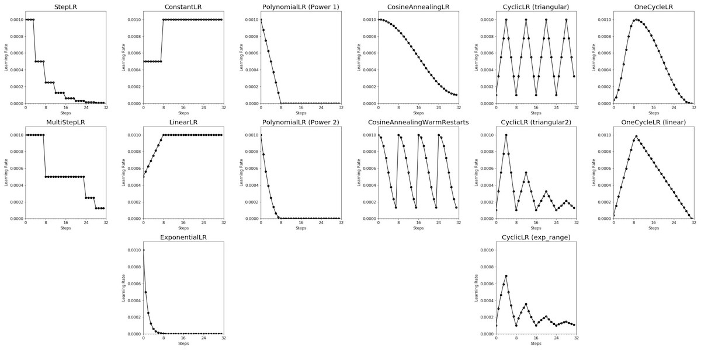

다음은 ExponetialLR `lr_scheduler`의 구현 예시다.

- $\gamma$ : 매 epoch마다 learning rate에 곱해지는 decay factor

$$ {lr}_{epoch} = \gamma \cdot {lr}_{epoch - 1} $$

```Python
optimizer = optim.SGD(model.parameters(), lr=0.01, momentum=0.9)
scheduler = optim.lr_scheduler.ExponentialLR(optimizer, gamma=0.9)

for epoch in range(20):
    # train
    for input, target in dataset:
        optimizer.zero_grad()
        output = model(input)
        loss = loss_fn(output, target)
        loss.backward()
        optimizer.step()
    # validation step의 경우, 이때 validation을 수행

    scheduler.step()
```

---

## 9.8 PyTorch: Defining nn Modules

PyTorch에서 `nn.Module` 신경망의 layer를 의미한다. weights나 다른 modules를 포함하며, 이를 상속받아 쉽게 신경망을 구성할 수 있다.

- `__init__`에서 NN layer를 초기화한다.

- backward 과정은 Autograd를 통해 자동으로 수행되므로 정의할 필요가 없다.

```Python
import torch

class TwoLayerNet(torch.nn.Module):
  def __init__(self, D_in, H, D_out):
    super(TwoLayerNet, self).__init__()
    self.linear1 = torch.nn.Linear(D_in, H)
    self.linear2 = torch.nn.Linear(H, D_out)

  def forward(self, x):
    h_relu = self.linear1(x).clamp(min=0)
    y_pred = self.linear2(h_relu)
    return y_pred

N, D_in, H, D_out = 64, 1000, 100, 10
x = torch.randn(N, D_in)
y = torch.randn(N, D_out)

model = TwoLayerNet(D_in, H, D_out)

optimizer = torch.optim.SGD(model.parameters(), lr=1e-4)
for t in range(500):
  y_pred = model(x)
  loss = torch.nn.functional.mse_loss(y_pred, y)

  loss.backward()
  optimizer.step()
  optimizer.zero_grad()
```

### <span style='background-color: #393E46; color: #F7F7F7'>&nbsp;&nbsp;&nbsp;📝 예제 1: Defining Modules &nbsp;&nbsp;&nbsp;</span>

다음과 같은 신경망 graph를 모듈 하나를 작성하여 이어붙이는 방식으로 구현하라.

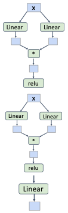

### <span style='background-color: #C2B2B2; color: #F7F7F7'>&nbsp;&nbsp;&nbsp;🔍 풀이&nbsp;&nbsp;&nbsp;</span>

```Python
import torch

class ParallelBlock(torch.nn.Module):
  def __init__(self, D_in, D_out):
    super(ParallelBlock, self).__init__()
    self.linear1 = torch.nn.Linear(D_in, D_out)
    self.linear2 = torch.nn.Linear(D_in, D_out)

  def forward(self, x):
    h1 = self.linear1(x)
    h2 = self.linear2(x)
    return (h1 * h2).clamp(min=0)

N, D_in, H, D_out = 64, 1000, 100, 10
x = torch.randn(N, D_in)
y = torch.randn(N, D_out)

model = torch.nn.Sequential(
            ParallelBlock(D_i, H),
            ParallelBlock(H, H),
            torch.nn.Linear(H, D_out))
```

---

## 9.9 PyTorch: DataLoaders

PyTorch에서는 데이터셋을 다루기 쉽도록 `DataLoader` 클래스를 제공한다.

- `datasets`: samples, labels를 담고 있다.

- `DataLoader`: dataset을 iterable하도록 wrapping한다.

   minibatching, shuffling, sampling, multithreading 등의 기능을 제공한다.

- iteration마다 model은 더 나은 예측을 하도록 학습된다.

  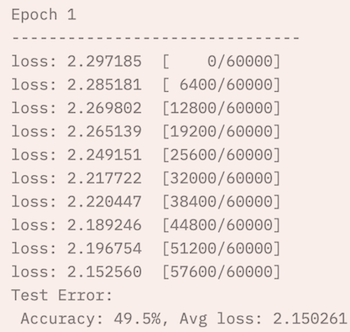

```Python
import torch
from torch.utils.data import TensorDataset, DataLoader

N, D_in, H, D_out = 64, 1000, 100, 10
x = torch.randn(N, D_in)
y = torch.randn(N, D_out)

# (x,y)를 데이터셋으로 묶어준다.
# batch_size=8로 설정하여, minibatch로 데이터를 8개씩 묶어준다.
loader = DataLoader(TensorDataset(x,y), batch_size=8)
model = TwoLayerNet(D_in, H, D_out)

optimizer = torch.optim.SGD(model.parameters(), lr=1e-2)

# 20 epoch
for epoch in range(20):
  # minibatch마다 forward, backward, update를 수행한다.
  for x_batch, y_batch in loader:
    y_pred = model(x_batch)
    loss = torch.nn.functional.mse_loss(y_pred, y_batch)

    loss.backward()
    optimizer.step()
    optimizer.zero_grad()
```

---

## 9.10 PyTorch: Saving and Loading Models

- `torch.save()` 함수를 이용하여 모델 가중치를 저장한다.

- `state_dict`: 각 layer와 parameter tensor를 매핑해 둔 dictionary

```Python
torch.save(model.state_dict(), PATH)
```

- `torch.load()` 함수를 이용하여 모델 가중치를 불러온다.

```Python
model = NeuralNetwork()
model.load_state_dict(torch.load(PATH))
```

---

## 9.11 PyTorch: Pretrained Models

torchvision 라이브러리를 사용하면 다양한 pretrained model을 쉽게 구성할 수 있다.

> [PyTorch Docs: MODELS AND PRE-TRAINED WEIGHTS](https://pytorch.org/vision/stable/models.html)

> [PyTorch github: pytorch/vision](https://github.com/pytorch/vision)

- quantization(양자화)을 거친 모델도 제공한다.

- `weights` 옵션을 이용하면 데이터셋을 특정하여 가중치를 가져올 수 있다.

```Python
import torch
import torchvision

# AlexNet
alexnet = torchvision.models.alexnet(pretrained=True)

# VGG-16
vgg16 = torchvision.models.vgg16(pretrained=True)

# ResNet-101
resnet101 = torchvision.models.resnet101(pretrained=True)
```

---

## 9.12 PyTorch: Dynamic Computation Graphs

그러나 앞서 backward가 끝나면 graph는 destroy되었다. 따라서 이 말은 iteration마다 매번 graph를 재구축하는 비효율적인 과정을 거쳐야 한다는 것을 의미한다. 하지만 이러한 구현이 갖는 장점이 있는데, Python의 control flow를 그대로 활용할 수 있다는 것이다.

특히 TensorFlow와 PyTorch의 가장 큰 차이점으로 꼽히는 부분이기도 하다. 다음 그림이 둘을 비교한 그림이다.

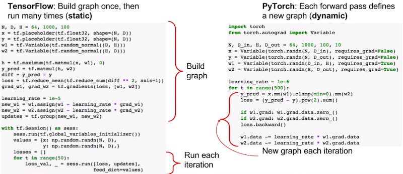

- static graph는 동작 전 최적화를 수행할 수 있다는 추가적인 장점을 갖는다.

  예를 들어 다음과 같이 operation을 합치는 최적화를 수행할 수 있다.

  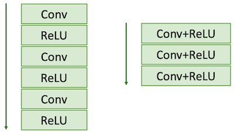

- 또한 static graph는 **serialize**가 가능하기 때문에, C++과 같은 언어로 deploy해서 빠르게 추론이 가능하다.

---

### 9.11.1 Static Graph with JIT

하지만 PyTorch에서도 JIT(Just In Time) 컴파일러를 사용하면 static graph를 구성할 수 있다.

- 신경망 모델을 Python 함수로 구현한다.

  > 예시를 위해 어떤 weight matrix를 사용할지 정하는 w2a, w2b, prev_loss를 추가하였지만, 실제로 이러한 구현을 통해 static graph를 구성해서는 안 된다.

  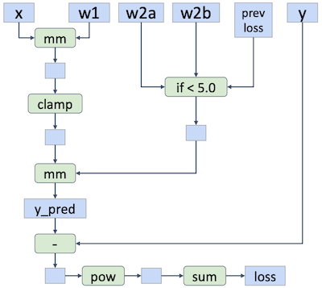

- 정의한 신경망 모델 함수 위에 `@torch.jit.script` annotation을 붙인다.

```Python
import torch

@torch.jit.script
def model(x, y, w1, w2a, w2b, prev_loss):
  w2 = w2a if prev_loss < 5.0 else w2b
  y_pred = x.mm(w1).clamp(min=0).mm(w2)
  loss = (y_pred - y).pow(2).sum()
  return loss

N, D_in, H, D_out = 64, 1000, 100, 10
x = torch.randn(N, D_in)
y = torch.randn(N, D_out)
w1 = torch.randn(D_in, H, requires_grad=True)
w2a = torch.randn(H, D_out, requires_grad=True)
w2b = torch.randn(H, D_out, requires_grad=True)

prev_loss = 5.0
learning_rate = 1e-6
for t in range(500):
  # 앞서 정의한 함수를 호출한다.
  loss = model(x, y, w1, w2a, w2b, prev_loss)

  loss.backward()
  prev_loss = loss.item()
```

---