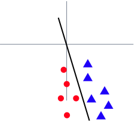
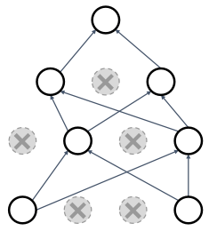

# 10 Training Neural Networks I

> [Lecture 10: Training Neural Networks I](https://youtu.be/lGbQlr1Ts7w)

---

## 10.1 Activation Functions

non-linear activation function이 없으면, 모든 linear operation은 하나의 single layer로 표현할 수 있다. 그만큼 신경망이 복잡성을 가지기 위해서는 activation function이 필요하다.


- Synapse = **parameter** = **weight**

- Neuron(Output Axon) = **feature** = **activation**

---

### 10.1.1 Sigmoid

**sigmoid**는 출력이 [0,1] 범위를 갖도록 squash하는 함수이다. 

$$ \sigma(x) = {{1}\over{(1+e^{-x})}} $$


다음은 sigmoid가 갖는 단점이다.

- 양쪽에 **saturation** 영역을 갖는다.

  제일 중대한 문제로, sigmoid에서 출력이 0이 되는 saturation 영역은 gradient를 0으로 만들기 때문에, 해당 레이어의 학습이 불가능하게 만든다.(saturated neurons "kill" the gradients)

$$ {{{\partial}L}\over{{\partial}x}} = {{{\partial}{\sigma}}\over{{\partial}x}} {{{\partial}L}\over{{\partial}{\sigma}}} $$

- 출력이 zero-centered가 아니다.

  - 한 번 sigmoid를 거친 값들은 모두 양수가 된다. 따라서 local gradient는 모두 positive한 값이 된다.

  - upstream gradient가 음수라면 언제나 음수, 양수라면 언제나 양수가 된다. 

  > 2차원이라면 사분면에서 update가 오로지 한 방향으로만 이루어지는 꼴이다. 문제는 DNN에서는 굉장히 많은 차원을 갖는 weight space가 있을 것이며, 이러한 단점이 굉장히 발목을 잡게 된다.

- exp 연산은 비싸다.

  GPU에서는 크게 문제가 되지 않지만, CPU나 embedded device에서는 문제가 될 수 있다.

---

### 10.1.2 Tanh

**tanh**는 출력이 [-1,1] 범위를 갖도록 squash하는 함수이다.


출력이 zero-centered로 sigmoid에 비해 개선되었다. 다음은 tanh 함수가 갖는 단점이다.

- 여전히 saturation 문제를 갖는다.

---

### 10.1.3 ReLU

이러한 saturation 문제를 일으키는 activation function과 달리, **ReLU**(Rectified Linear Unit)는 양수에서 saturation되지 않는다.


computationally efficient하며, sigmoid/tanh와 비교하여 훨씬 빠르게 수렴한다. 다음은 ReLU가 갖는 단점이다.

- 출력이 zero-centered가 아니다.

- annoyance

  - 예를 들어 입력이 0일 때와 -10일 때, 둘 다 gradient는 동일하게 0이 된다. ReLU를 쓰면 0보다 작은 값에 대해서는 학습을 하지 않게 된다. 

  - 한 번 dead ReLU가 되면, 영원히 해당 값은 update가 되지 않는다.

---

### 10.1.4 Leaky ReLU

**Leaky ReLU**는 ReLU가 갖는 문제를 해결하기 위해 나온 함수이다. 양수에서는 마찬가지로 identity function처럼 작동하고, 음수에서는 작은 양수를 곱해준다.

$$ f(x) = \max(0.01x, x) $$


ReLU와 마찬가지로 computationally efficient하며, sigmoid/tanh와 비교해서 훨씬 빠르게 수렴한다. 무엇보다도 **dead ReLU** 문제를 해결한다. 하지만 최적의 학습을 위해서, 앞서 0.01로 둔 hyperparameter를 학습을 통해 최적화할 수 있다.

- Parametric Rectifier (PReLU)

$$ f(x) = \max(\alpha x, x) $$

---

### 10.1.5 ELU

$$ f(x) = \begin{cases} x & \mathrm{if} \, x > 0 \\ \alpha (\exp (x) - 1) & \mathrm{if} \, x \le 0 \end{cases} $$


---

### 10.1.6 SELU

ELU의 scaled version으로, 다음과 같은 $\alpha$ 와 $\lambda$ 를 사용한다.

$$ f(x) = \begin{cases} \lambda x & \mathrm{if} \, x > 0 \\ \lambda (\alpha\exp (x) - \alpha) & \mathrm{if} \, x \le 0 \end{cases} $$

- $\alpha$ = 1.6732632423543772848170429916717

- $\lambda$ = 1.0507009873554804934193349852946


BatchNorm과 같은 normalization을 쓰지 않아도 DNN을 학습할 수 있다는 장점을 가진다.

---

### 10.1.7 Activation Functions: Summary

하지만 다른 activation function을 쓴다고 해서, 정확도 면에서 큰 향상을 기대하기는 어렵다. 다음은 CIFAR10 데이터셋을 이용한 세 모델의 학습에서, 다양한 activation function을 이용했을 때의 정확도를 비교한 것이다.


데이터셋, 모델 구조, 하이퍼패러미터 등에 따라 이러한 결과는 달라지게 되므로, 0.1%p 단위를 반드시 개선해야 하는 상황이 아니면 ReLU를 사용하는 것이 좋다.

> Leaky ReLU/ELU/SELU/GELU는 사용하더라도, sigmoid와 tanh는 꼭 사용하지 않도록 한다.

---

## 10.2 Data Preprocessing

효율적인 훈련을 위해서는 데이터셋을 신경망의 입력으로 전달하기 전에, 먼저 전처리 과정을 거쳐야 한다. 아래 그림의 세 가지 데이터 유형을 살펴보자.


위는 2차원 예시인데, x축과 y축이 서로 다른 feature이다. 실제로 feature가 다양해서 차원도 클 경우, 원점에서 굉장히 멀거나 편차가 큰 데이터들이 존재하게 된다. 

또한 예를 들어 모든 입력이 양수를 갖는다고 가정하면, 모든 weight의 업데이트가 한 방향으로만 이루어질 것이다.(2차원이면 한 사분면으로만 진행)

다음과 같이 선형 분류기를 학습하는 경우를 생각해보자.

- before normalization

  loss가 weight matrix의 변화에 굉장히 민감하다. 따라서 optimization이 어렵다.

  

- after normalization

  loss가 weight의 작은 변화에 덜 민감하다. 따라서 optimization이 수월하다.

  

---

### 10.2.1 Data Preprocessing for Images

예를 들어 (32,32,3) 크기의 CIFAR-10 이미지가 있다고 하자. data processing은 다음과 같은 과정으로 진행된다.

1. per-channel mean을 뺀다.

2. per-channel std로 나눈다.

---

## 10.3 Weight Initialization

모델을 학습하기 위해서는 먼저 weight와 bias를 특정한 값으로 초기화해야 한다.


단순하게 모든 W, b를 0으로 초기화한다면 어떻게 될까? 모든 결과값도 0이 되므로 학습이 불가능하게 된다. 따라서 초기화를 위해서는 다른 방법을 고려해야 한다.

---

### 10.3.1 Activation Statistics

그렇다면 평균으로 0을 갖고, 표준편차로 0.01을 갖는 정규 분포에서 임의의 작은 값으로 초기화하면 어떻게 될까? 이러한 방법은 작은 신경망에서는 유효할 수 있으나, 깊은 신경망일수록 문제가 발생하게 된다.

```python
W = 0.01 * np.random.randn(Din, Dout)
```

이유를 알아보기 위해서, 다음과 같은 코드가 있을 때 6개 레이어로 구성된 fully-connected network의 forward pass를 살펴보자.

```python
dims = [4096] * 7
hs = []               # hidden state
x = np.random.randn(16, dims[0])
for Din, Dout in zip(dims[:-1], dims[1:]):
  W = 0.01 * np.random.randn(Din, Dout)
  x = np.tanh(x.dot(W))
  hs.append(x)
```

위 신경망에서 레이어별 activation 값의 분포를 살펴보면 다음과 같은 결과를 얻을 수 있다.


- 네트워크가 깊어질수록 activation이 0으로 붕괴된다.

그렇다면 표준편차를 0.05로 늘려서 activation이 붕괴되지 않도록 늘리면 어떨까?

```python
W = 0.05 * np.random.randn(Din, Dout)
```

결과를 보면, weight가 너무 크기 때문에 모든 activation 값이 saturate된 것을 알 수 있다. 


- activation이 saturation 영역으로 확산되므로, local gradient가 모두 0이 된다.

따라서 너무 작아도, 너무 크지도 않은 가중치로 초기화하는 방법이 필요하다.

---

### 10.3.2 Xavier Initialization

다음은 **Xavier Initialization** 방법을 살펴보자. Xavier Initialization에서는 표준편차를 '입력 차원의 제곱근에 역수를 취한 값'으로 사용한다.

- std = 1/sqrt(Din)

앞서 살펴본 예제 코드에 Xavier Initialization을 적용해보자.

```python
dims = [4096] * 7
hs = []               # hidden state
x = np.random.randn(16, dims[0])
for Din, Dout in zip(dims[:-1], dims[1:]):
  W = np.random.randn(Din, Dout) / np.sqrt(Din)    # Xavier Initialization
  x = np.tanh(x.dot(W))
  hs.append(x)
```

> CNN일 경우, Din은 kernel size \* kernel size \* \#input channels가 된다.

레이어별 activation 값의 분포가 적절하게 유지되는 것을 확인할 수 있다.


그렇다면 어떠한 기준으로 이러한 표준편차를 사용한 것일까? 바로 입력과 출력의 분산(variance)이 같아지도록 하는 트릭이다.

$$ \mathrm{Var}(y_i) = \mathrm{Din} \times \mathrm{Var}(x_iw_i) $$

$$ = \mathrm{Din} \times \mathrm{Var}(x_i) \times \mathrm{Var}(w_i) $$

따라서 $\mathrm{Var}(y_i) = \mathrm{Var}(x_i)$ 가 되려면 다음을 만족해야 한다.

$$ \mathrm{Var}(w_i) = {1 \over {\mathrm{Din}}} $$

---

### 10.3.3 What about ReLU?

하지만 activation function으로 ReLU를 사용하게 된다면, activation의 값이 서서히 0으로 붕괴하는 현상을 다시 관찰할 수 있다. Xavier initialization는 기본적으로 zero-centered activation function을 가정했기 때문이다.

```python
dims = [4096] * 7
hs = []               # hidden state
x = np.random.randn(16, dims[0])
for Din, Dout in zip(dims[:-1], dims[1:]):
  W = np.random.randn(Din, Dout) / np.sqrt(Din)    # Xavier Initialization
  x = np.maximum(0, x.dot(W))
  hs.append(x)
```


---

### 10.3.4 Kaiming Initialization

따라서 ReLU에서는 약간의 correction을 거친다.(입력의 절반을 죽인다는 점을 생각하여 correction을 수행한다.) 이러한 초기화 방법을 **Kaiming(MSRA) initialization**이라고 한다.

- std = sqrt(2/Din)

```python
dims = [4096] * 7
hs = []               # hidden state
x = np.random.randn(16, dims[0])
for Din, Dout in zip(dims[:-1], dims[1:]):
  W = np.random.randn(Din, Dout) * np.sqrt(2) / np.sqrt(Din)    # Xavier Initialization
  x = np.maximum(0, x.dot(W))
  hs.append(x)
```


> batch normalization이 등장하기 전, VGGNet의 from scratch 학습을 성공시킨 방법으로도 유명하다.

---

### 10.3.5 Residual Networks

하지만 **residual block**을 사용할 경우, MSRA 초기화 방법에 문제가 생기게 된다.


- Var(F(x) + x) > Var(x)

  따라서 residual block을 거칠 때마다 variance가 커지게 된다.

하지만 다음과 같은 방법으로 초기화를 한다면,  Var(F(x) + x) = Var(x)를 만족시킬 수 있다.

- 첫 번째 conv는 MSRA로 초기화한다.

- 두 번째 conv는 0으로 초기화한다.

---

## 10.4 Regularization

지금까지는 학습을 시작하는 방법을 설명했다면, 지금부터는 학습을 잘 진행하기 위한 방법을 살펴볼 것이다. 먼저 다음과 같은 overfitting 문제를 방지하는 **regularization**을 살펴보자.


---

### 10.4.1 Add term to the loss

먼저 loss에 추가 항을 넣어줄 수 있다.

```math
L = {{1} \over {N}}\sum_{i=1}^{N}\sum_{j \neq y_i} \max (0, f(x_i; W)_j - f(x_i; W)_{y_i}+1) + \lambda R(W)
```

- $\lambda R(W)$ : regularization

다음은 대표적인 regularization 방법이다.

- **L2 regularization**

  가장 널리 쓰이는 방법으로, weight decay로도 불린다.

$$ R(W) = \sum_{k} \sum_{l} W_{k,l}^2 $$

- **L1 regularization**

$$ R(W) = \sum_{k} \sum_{l} |W_{k,l}| $$

- **Elastic Net(L1+L2)**

$$ R(W) = \sum_{k} \sum_{l} \beta W_{k,l}^2 + |W_{k,l}| $$

---

### 10.4.2 Dropout

**dropout**은 신경망이 feature에 **co-adaptation**되는 문제를 방지한다. 다음은 고양이 분류기를 학습하는 예시다. 보다 고양이에 알맞는 robust feature를 학습할 수 있다.


하지만 그 특성상 binary mask를 가질 수 있는 경우의 수가 굉장히 많아지게 된다. 



> 예를 들어 4096 unit을 갖는 FC layer의 경우, $2^{4096}~10^{1233}$ 개의 mask를 가질 수 있다.

> 하나의 큰 네트워크에서, 가중치를 공유하는 하나의 sub-network를 학습하는 것과 같다.

---

#### 10.4.2.1 Dropout: Test Time

또한 dropout을 적용하게 되면, 특성상 얻게 되는 출력은 random한 값이 된다. 내가 모델을 서빙하고 있을 때, 전날은 고양이로 인식한 입력이 다음날은 강아지가 되서는 안 될 것이다. 

$$ y = fw(x,z) $$

- $z$ : random mask

따라서 test-time에서는 dropout의 randomness를 제거해야 한다. 이는 randomness를 평균화(average out)하는 것으로 해결할 수 있다.

$$ y = f(x) = E_z[f(x,z)] = \int p(z) f(x,z) dz $$

하지만 이러한 적분은 너무 복잡하기 때문에, 이를 근사한 방정식을 사용한다. 다음과 같은 하나의 neuron 예시를 생각해 보자.


- test time: 기대하는 출력값은 다음과 같다.

$$ E[a] = w_1x + w_2y $$

- training time(dropout rate = 0.5)

$$ E[a] = {1 \over 4}(w_1x + w_2y) + {1 \over 4}(w_1x + 0y) $$

$$ = {1 \over 4}(0x +0y) + {1 \over 4}(0x + w_2y) $$

$$ = {1 \over 2}(w_1x + w_2y) $$

이처럼 training time에서의 기대치는 dropout rate를 곱한 값과 동일하다. 따라서 test time에서의 출력에 dropout rate를 곱해주면, training time에서의 기대치와 동일한 값을 얻을 수 있다.

```python
p = 0.5

# training time
def train(x):
  # 3 layer MLP 예시
  H1 = np.maximum(0, np,dot(W1, x) + b1)
  U1 = np.random.rand(*H1.shape) < p     # dropout mask
  H1 *= U1                               # drop
  H2 = np.maximum(0, np.dot(W2, H1) + b2)
  U2 = np.random.rand(*H2.shape) < p     # dropout mask
  H2 *= U2                               # drop
  out = np.dot(W3, H2) + b3

# test time
def pred(x):
  H1 = np.maximum(0, np.dot(W1, x) + b1) * p # scale
  H2 = np.maximum(0, np.dot(W2, H1) + b2) * p # scale
  out = np.dot(W3, H2) + b3
```

하지만 위와 같은 방법보다도, 주로 다음과 같은 **inverted dropout** 방법을 사용한다. 이 경우 test time에서 scale을 적용하지 않아도 된다.

```python
p = 0.5

# training time
def train(x):
  # 3 layer MLP 예시
  H1 = np.maximum(0, np,dot(W1, x) + b1)
  U1 = (np.random.rand(*H1.shape) < p) / p     # dropout mask
  H1 *= U1                                     # drop
  H2 = np.maximum(0, np.dot(W2, H1) + b2)
  U2 = (np.random.rand(*H2.shape) < p) / p     # dropout mask
  H2 *= U2                                     # drop
  out = np.dot(W3, H2) + b3

# test time
def pred(x):
  H1 = np.maximum(0, np.dot(W1, x) + b1) # no scaling necessary
  H2 = np.maximum(0, np.dot(W2, H1) + b2)
  out = np.dot(W3, H2) + b3
```

---

#### 10.4.2.2 Dropout architectures

그렇다면 dropout을 신경망 구조의 어느 위치에 적용해야 할까? 다음은 AlexNet, VGG-16 네트워크의 parameters 분포를 나타낸 그래프다.


- parameters 대부분이 네트워크 종단부의 FC layer에 집중되어 있다.

  따라서 해당 부분에 dropout을 적용하는 것이 좋다.

하지만 이보다 더 늦게 나온 GoogLeNet, ResNet 등에서는 fully-connected layers 대신 global average pooling을 사용한다. 따라서 dropout을 적용할 필요가 없다.

---

### 10.4.3 Regularization: A common pattern

training, testing의 두 단계를 나눠서 잠시 패턴을 분석해보자.

- training

  dropout과 같이 randomness가 포함된 방법을 사용한다.

- testing

  randomness를 average out한다.(이때 근사식을 사용하기도 한다.)

이러한 패턴은 특히 **batch normalization**에서도 관찰된다.

- training

  임의의 mini-batch에서의 평균과 분산을 바탕으로 normalize한다.

- testing

  normalize를 수행할 때 fixed stats를 사용한다.

> 특히 ResNet과 이후의 신경망에서는 L2와 batch normalization만을 regularizer로 사용하는 설정이 일반적이다.

---

### 10.4.4 Data Augmentation

그런데 randomness를 추가하는 방법으로 **data augmentation**을 적용하는 것도 가능하다.

- Horizontal flip(수평 뒤집기)

  

- Random Crops / Scales

  

  - 예를 들어 ResNet에서는 우선 [256,480] 범위에서 무작위로 길이 L을 고른 뒤, 이미지의 최단 길이가 L이 되도록 입력을 resize한다. 그리고 무작위로 224x224 patch를 crop한다.

  - test time에서는 resize scale을 고정한다.(예를 들면 {224, 256, 384, 480, 640})
 
- Color Jitter

  R,G,B에 PCA를 적용 한 뒤, 수식에 따라서 color offset을 산출한다. 그리고 입력의 모든 pixel에 해당 offset을 더해준다.

  

> 이러한 data augmentation은 해결하려는 문제에 따라 다양한 방법의 적용을 고려할 수 있다.

> translation, rotation, stretching, shearing, lens distortions 등

---

### 10.4.5 DropConnect

**DropConnect**는 dropout과 비슷하나, activation을 0으로 만들기보다는 weight를 0으로 만드는 방법이다.(connection을 삭제)


---

### 10.4.6 Fractional Pooling

**fractional pooling** 방법은 pooling layer에서도 randomness를 추가하는 방법이다. pooling region을 2x2, 1x1식으로 무작위로 선택한다.

- test time에서는 서로 다른 샘플의 average predictions을 사용한다.


---

### 10.4.7 Stochastic Depth

**stochastic depth**은 신경망의 block을 무작위로 drop하여 학습하는 방법이다.

- test time에서는 네트워크 전체 block을 사용한다.


---

### 10.4.8 Cutout

학습 시 입력 이미지에서 임의의 영역을 0으로 만든다.

- test time에서는 원본 이미지를 사용한다.


---

### 10.4.8 Mixup

학습 시 여러 입력 이미지를 하나로 섞어서 학습한다.

- test time에서는 원본 이미지를 사용한다.


- 고양이를 40%, 강아지를 60% 섞어서 학습

> 특히 CIFAR10와 같은 소규모 데이터셋에서는 Cutout, Mixup을 같이 사용하면 상당히 효과적이다. 하지만 ImageNet과 같은 대규모 데이터셋에서는 효과가 미미하다.

---