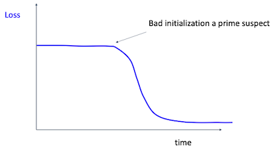
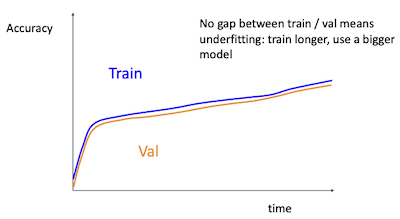

# 11 Training Neural Networks II

> [Lecture 11: Training Neural Networks II](https://youtu.be/WUazOtlti0g?si=ocuRrHezpn6Aw0ML)

---

## 11.1 Learning Rate

SGD, SGD+Momentum, Adagrad, RMSProp, Adam 등은 모두 하이퍼패러미터로 **learning rate**(학습률)을 갖는다. 다음은 epoch에 따른 여러한 learning rate의 변화를 나타낸 예시다.


- (노란색) learning rate가 너무 커서 exploding이 발생한다.

- (파란색) learning rate가 작아서 느리긴 하지만 안정적으로 학습한다.

- (초록색) learning rate가 커서, 학습은 빠르게 진행되지만 지역 최적점에 빠진다.

- (빨간색) learning rate가 적당해서, 학습이 비교적 빠르고 안정적으로 진행된다.

따라서 이러한 tradeoff에서 적절한 learning rate를 찾는 것이 중요하다. 그렇다면 어떻게 찾아야 할까? 적절한 접근법은 "큰 learning rate로 시작해서 시간에 따라 decay를 시키기"이다. 이러한 접근을 **learning rate schedule**이라고 한다.

---

### 11.1.1 Learning Rate Decay

이러한 learning rate decay도 다양한 방식으로 적용할 수 있다.

- step

  

  이러한 step 방식의 decay를 적용할 경우, epoch에 따른 training loss도 다음과 같이 step 형태로 변화한다. 아래 예시는 ResNets 학습에서 30, 60, 90 epoch에서 lr에 0.1을 곱한 training loss 그래프다.

  

- cosine

  CV 도메인에서 가장 인기 있는 learning rate schedule 방식이다. learning rate의 감소 형상이 cosine wave와 유사한 것을 볼 수 있다.

  > 경험적으로 cosine 방식을 사용할 때는 오래 학습하는 것이 성능 면에서 좋다.

  

  이러한 cosine 방식의 decay를 적용할 경우, epoch에 따른 traing loss는 다음과 같은 형태가 된다.

  

  다른 learning rate schedule 방식과 비교해도, <U>오직 두 가지 하이퍼패러미터</U>만 조정하면 되기 때문에 훨씬 간단하다.

  - ${\alpha}_0$ : initial learning rate

  - $T$ : 총 epoch 수

$$ {\alpha}_t = {1 \over 2}{\alpha}_0 (1+\cos(t\pi / T)) $$

- linear

  > 보통 LLM에서 많이 사용한다. 대표적으로 BERT, RoBERT, XLNet 등의 논문이 있다.

  

$$ {\alpha}_t = {\alpha}_0 (1-t/T) $$

- Inverse sqrt

  > Transformer를 발표한 논문인 "Attention is all you need"(2017)에서 사용했다.

  

$$ {\alpha}_t = {{\alpha}_0 \over \sqrt{t}} $$

- constant

  사실 단순히 모든 훈련 과정에서 동일한 learning rate를 사용하는 방법도, 많은 경우에서 잘 동작한다. 
  
  > 특히 새로운 모델을 개발하고 훈련할 때는, 처음부터 learning rate를 조절하려고 하기보다 일단 constant learning rate를 사용하는 것이 좋다.

  > Adam이나 RMSProp과 같은 복잡한 momentum을 사용할 경우, constant learning rate를 사용하는 방법이 오히려 복잡한 learning rate schedule을 사용하는 것보다 더 좋은 성능을 낼 수 있다.

  

$$ {\alpha}_t = {\alpha}_0 $$

---

### 11.1.2 Early Stopping

신경망을 학습할 때, epoch별 training accuracy와 validation accuracy를 모두 확인하는 것이 좋다.

- 일반적으로 training을 중단하고 싶은 구간은 'validation accuracy'가 최대가 되는 구간이다.

따라서 epoch이 증가하면서 validation accuray를 관측하다가, validation accuracy가 감소하기 전의 checkpoint를 선택하면 된다. 이러한 방법을 **early stopping**이라고 한다.


---

## 11.2 Choosing Hyperparameters 

그렇다면 학습을 위한 하이퍼패러미터는 어떻게 선택해야 할까?

> 대표적으로 learning rate, learning rate decay, minibatch size, L2 regularization coefficient가 있다. 

> 이외 학습 알고리즘이나 다른 regularization 패러미터, 경우에 따라서는 네트워크 구조(depth, kernel size 등)도 하이퍼패러미터로 간주할 수 있다.

---

### 11.2.1 Grid Search

쉽게 사용할 수 있는 방법으로 **grid search**가 있다. 먼저 search를 수행할 하이퍼패러미터 집합을 만들어야 한다. 예를 들어 다음과 같이 만들 수 있다.

- weight decay: $[1 \times 10^{-4}, 1 \times 10^{-3}, 1 \times 10^{-2}, 1 \times 10^{-1}]$

- learning rate: $[1 \times 10^{-4}, 1 \times 10^{-3}, 1 \times 10^{-2}, 1 \times 10^{-1}]$

위 예시에서는 16개의 선택 가능한 조합이 생긴다. GPU가 충분하다면 모든 조합을 선택해서 실험해 보면 되겠지만, 위보다 더 찾아야하는 하이퍼패러미터가 많아진다면 이러한 방법은 불가능하다.

---

### 11.2.2 Random Search

> [On Network Design Spaces for Visual Recognization 논문(2019)](https://arxiv.org/abs/1905.13214)

grid search와 비슷하지만, 하이퍼패러미터를 무작위로 선택하는 **random search**를 이용할 수 있다. 예를 들어 다음과 같이 하이퍼패러미터 범위를 정의하자.

- weight decay: log-uniform on $[1 \times 10^{-4}, 1 \times 10^{-1}]$

- learning rate: log-uniform on $[1 \times 10^{-4}, 1 \times 10^{-1}]$

> 하이퍼패러미터의 종류에 따라 linear한 분포를 사용할지, log-uniform 분포를 사용할지 결정한다.

random search는 이러한 범위 내에서 무작위로 하이퍼패러미터를 선택해서 학습한다. 특히 하이퍼패러미터가 많을수록, 대체로 random search가 grid search보다 더 좋은 성능을 낸다.

다음은 서로 다른 learning rate와 weight decay 간의 interaction을 보여주는 예시다.


- x축: learning rate, y: weight decay(regularazation 강도)

- 색상: 순위(error rate). 보라색으로 표시된 영역이 가장 좋은 성능

---

### 11.2.3 Bayesian Optimization

> [COGNEX: Bayesian Optimization 개념 정리](https://www.cognex.com/ko-kr/blogs/deep-learning/research/overview-bayesian-optimization-effective-hyperparameter-search-technique-deep-learning-1)

> [COGNEX: Bayesian Optimization 실습](https://www.cognex.com/ko-kr/blogs/deep-learning/research/overview-bayesian-optimization-effective-hyperparameter-search-technique-deep-learning-2)

> [DACON: Bayesian Optimization 실습](https://dacon.io/codeshare/1720)

**Bayesian Optimization**은 최적화에 오랜 시간이 걸리는 미지의 objective function $f$ 에서 최적해(현재는 하이퍼패러미터 집합) $x^{*}$ 를 찾는 방법이다. 

> 미지의 목적 함수 $f(x)$ 를 black-box function으로도 지칭한다.

Bayesian Optimization의 핵심은 아래 두 가지 요소다.

- **Surrogate Model**

  surrogate model이란 미지의 목적 함수 $f(x)$ 를 확률적인 추정을 통해 근사한 함수 $g(x)$ 를 뜻한다.

- **Acquisition Function**

  acquisition function(획득 함수)는 현재까지의 추정 결과를 바탕으로, 다음에 검토할 하이퍼패러미터 후보 $x_{t+1}$ 을 찾아주는 함수를 뜻한다.

---

#### 11.2.3.1 Surrogate Model

Bayesian Optimization에서 surrogate model로 가장 많이 사용하는 확률 모델(probabilistic model)로 **Gaussian Process**(GP)가 있다.

GP에서는 구성 요소들 간의 결합 분포(joint distribution)가 Gaussian distribution(가우시안 분포, 정규 분포)을 따른다.

$$ f(x) ~ \mathcal{GP}(\mu (x), k(x, x')) $$

- $\mu (x)$ : 평균 함수

- $k(x, x')$ : 공분산 함수

다음은 GP를 사용한 Bayesian Optimization의 시간 경과에 따른 진행 예시다.


- 지금까지의 값 $(x_1, f(x_1)), \cdots, (x_t, f(x_t))$ 를 바탕으로 평균 함수 $\mu (x)$ , 표준편차 함수 $\sigma (x)$ 를 계산한다.

  - $\mu(x)$ 는 지금까지의 값 $(x_1, f(x_1)), \cdots, (x_t, f(x_t))$ 을 반드시 지나도록 형태가 정해진다.

  - 따라서 현재까지 조사된 점에서 먼 지점일수록 불확실성이 크다.

- $t=2$ : 조사된 값이 2개밖에 없어서 먼 영역의 불확실성 $\sigma (x)$ 가 크다.

- $t=3, t=4$ : 점차 조사된 점의 수가 늘어나면서 불확실성 $\sigma (x)$ 가 줄어든다.

이처럼 조사된 점이 많아지면 많아질수록 최적 $x^{*}$ 를 찾을 가능성이 늘어나게 된다.

> GP 외 다른 surrogate model로는 Tree-structured Parzen Estimator(TPE), Deep Neural Network 등이 있다.

---

#### 11.2.3.2 Acquisition Function

그렇다면 acquisition function은 어떻게 다음에 조사할 입력값 $x_{t+1}$ 을 추정하는 것일까? 앞서 예시의 $t=2$ 상황을 다시 살펴보자.


- trade-off 관계에 있는 두 가지 전략(exploitation, exploration)을 적절하게 조절하며 탐색한다.

- **exploitation**(착취)

  $t=2$ 까지 조사된 두 점을 기준으로는, $f(x)$ 가 더 큰 오른쪽이 최적의 $x^{*}$ 가 있을 가능성이 크다.

- **exploration**(탐색)

  하지만 두 점 사이의 불확실성 $\sigma (x)$ 가 크기 때문에, 현재의 평균 함수 $\mu (x)$ 가 실제 목적 함수와 유사할 것으로 장담하기 어렵다. 따라서 불확실성이 큰 영역을 조사하는 선택도 시도할 수 있다.

> 두 전략을 적절하게 조절하기 위한 판단으로는, 대표적으로 **Expected Improvement**(EI)를 사용한다. EI는 특정 $x$ 가 현재까지의 최대 값 $f(x^{+})$ 보다 좋을 수 있는 가능성(유용성)을 예측한다.

> EI는 위 예시 그림에서 초록색 실선에 해당된다.

---

### 11.2.4 without tons of GPUs

하지만 이러한 하이퍼패러미터 탐색을 위한 GPU 자원이 부족하면 어떻게 해야 할까? 몇 가지 활용할 수 있는 방법을 살펴보자.

1. 먼저 weight decay를 사용하지 않고 초기 loss를 확인한다.

   예를 들어 Cross-Entropy loss를 사용했다면, 예상되는 초기 loss는 $-\log(1/C)$ 이다.( $C$ : 클래스 수 )

   > 하지만 버그가 있다면 loss가 이상하게 나올 것이다. 이 경우 코드를 수정해야 한다.

2. small sample에 overfit시킨다.

   학습 데이터셋의 5~10개 minibatch만을 사용해서, 100% training accuracy를 얻도록 학습시킨다.

   - 이때 regularization은 사용하지 않는다.

   - loss가 줄어들지 않으면 lr이 너무 낮은 것이다.

   - loss가 inf 혹은 NaN으로 explode한다면 lr이 너무 높은 것이다.

3. loss가 줄어드는 lr을 찾는다.

   모든 학습 데이터셋을 사용해서, 100 iteration 동안 loss drop이 제일 큰 lr을 찾는다.

   - 1e-1, 1e-2, 1e-3, 1e-4 정도의 lr을 시도해 본다.

4. 1~5 epoch 사이를 학습하며 coarse grid 내 최적의 lr을 찾는다.

   3번에서 찾은 learning rate를 기반으로, 몇 가지 learning rate와 weight decay 조합을 바탕으로 1~5 epoch 사이를 학습하며 최적 조합을 찾는다.

   - weight decay는 1e-4, 1e-5, 0 정도의 값으로 시도해 본다.

5. refine grid 후 좀 더 길게 학습한다.

   4번에서 찾은 조합으로, learning rate decay 없이 10~20 epoch 정도를 학습해 본다.

6. learning curves를 보고 판단한다.(5번으로 돌아가서 반복)

---

#### 11.2.4.1 Learning Curve

이때 learning curve를 보는 요령이 있다. loss가 noisy하다면 scatter plot으로 시각화하는 것이 좋으며, moving average를 계산해서 표시하는 것이 trend를 파악하는 데 더 도움이 된다.


또한 몇 가지 loss 곡선 예시를 보며 어떤 상황인지 파악해 보자.

- 처음에는 평평하다가 급격한 하락

  

  이는 초기화가 잘못되었음을 의미한다.(훈련 초기에 진전이 없기 때문)

- 처음에는 진전이 있다가 이후 진전이 없음

  

  lr이 너무 클 수 있다. 정체되는 구간에 learning rate decay를 도입하면 진전될 수 있다.

- (learning rate decay 도입) 처음에는 진전이 있다가 진전이 없음

  

   learning rate decay가 너무 빠르다. learning rate decay를 느리게 하거나, learning rate를 더 크게 해야 한다.

다음은 train, val accuracy를 시간에 따라 시각화한 예시를 살펴보자.

- 정상

  

- validation acc 곡선이 감소

  

  overfitting이 발생하고 있다. 이 경우 regularization을 도입하거나, data를 늘려서 학습해야 한다.

- train / validation acc 곡선의 gap이 없음

  

  underfitting이 발생하고 있다. 이 경우 학습을 더 길게 하고, 모델을 더 크게 만들어야 한다.

---

## 11.3 Cross-validation

이처럼 다양한 하이퍼패러미터 조합에서 최적의 하이퍼패러미터를 찾아내려면, 많은 조합을 병렬로 학습하면서 cross-validation을 수행해야 한다. 현재는 Tensorboard와 같은 시각화 도구를 사용해서 쉽게 수행할 수 있다.


---

## 11.4 Track ratio of 'weight update / weight magnitude'

하나의 유용한 heuristic으로 'weight update / weight magnitude' 비율을 모니터링하면, 학습이 잘 진행되는지 확인할 수 있다.

- 0.001 혹은 비슷한 값으로 update되는 것이 경험적으로 훈련이 잘 진행된다.

```Python
# W: parameter vector
# dW: gradient vector
param_scale = np.linalg.norm(W.ravel())
update = -learning_rate * dW             # simple SGD update
update_scale = np.linalg.norm(update.ravel())
W += update                              # 실제 update
print(update_scale / param_scale)        # print ratio
                                         # 예상은 -1e-3
```

---