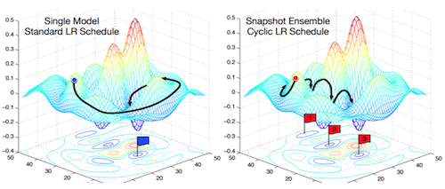
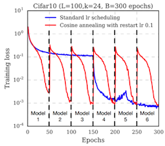
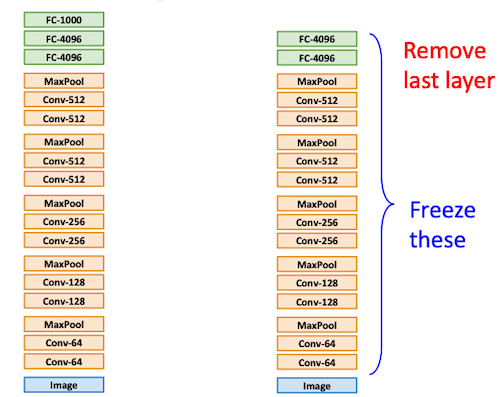
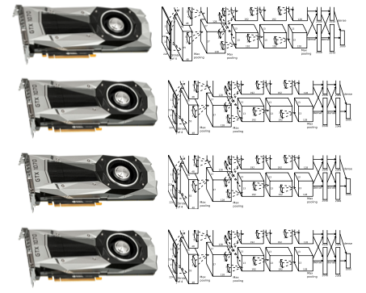
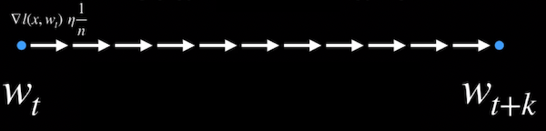
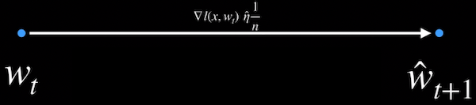
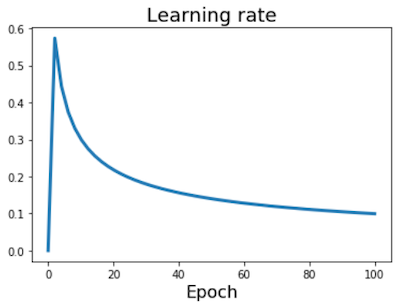

# 11 Training Neural Networks II

> [Lecture 11: Training Neural Networks II](https://youtu.be/WUazOtlti0g?si=ocuRrHezpn6Aw0ML)

> 11.5절 이후: 훈련이 끝난 후 적용할 수 있는 기법들(After training)

---

## 11.5 Model Ensembles

> [Snapshot Ensembles: Train 1, get M for free 논문(2017)](https://arxiv.org/abs/1704.00109)

다양한 **model ensembles** 방법을 사용하면 최종 성능을 더 이끌어낼 수 있다.

- N개의 independent models를 학습하기

  - test time에서 average 결과값을 사용하는 것만으로도 1~2% 성능 향상을 얻을 수 있다.

  - predicted probability distributions의 average를 계산한 뒤, 가장 높은 값을 가지는 class를 선택한다.(argmax)

- single model의 여러 snapshot를 사용하기

  혹은 하나의 모델에서 저장한 여러 snapshot(checkpoint)을 가지고 ensemble한다.

  

  이때 periodic learning rate schedule을 사용하여, snapshot마다 다양한 optimum을 얻도록 할 수 있다.

  

- 훈련 중 가중치의 running average를 사용하기

  실제 parameter vector를 저장하는 대신, parameter vector의 running average를 저장한다. 그리고 이를 test time에서 사용한다.(Polyak averaging)

  > Batch Normalization처럼 weight도 running average를 사용하여 성능을 향상시킬 수 있다.

```python
while True:
    data_batch = dataset.sample_data_batch()
    loss = network.forward(data_batch)
    dx = network.backward()
    x += - learning_rate * dx
    x_test = 0.995 * x_test + 0.005 * x    # test set용
```

---

## 11.6 Transfer Learning with CNNs

> [DeCAF: A Deep Convolutional Activation Feature for Generic Visual Recognition 논문(2014)](https://arxiv.org/abs/1310.1531)

많은 GPU 자원과 매우 큰 데이터셋이 없더라도, **trasfer learning**(전이 학습)을 통해 성능이 좋은 모델을 얻을 수 있다. 다음은 ImageNet 데이터셋으로 학습한 CNN 모델(AlexNet)을, 전이 학습을 통해 다른 task에 적용시키는 예시다.



- 입력부가 아래, 출력부가 위쪽에 해당된다.

  **입력부에 가까울수록 보다 generic**한 특징, **출력부에 가까울수록 보다 specific**한 특징을 학습한다.

1. ImageNet의 1,000개 class score를 계산하기 위한 마지막 FC layer를 삭제한다.

    마지막 FC-4096의 출력을 feature vector처럼 사용한다.

2. 해당 구조를 새로운 데이터셋에 대해 fine-tuning를 수행한다.

    이때 기존 학습에서 사용한 learning rate의 ~1/10 수준으로 훈련한다.

    > 간혹 연산량을 줄이기 위해 lower layers의 weight는 고정시키는 경우도 있다.

일반적으로 ImageNet에서 잘 동작하는 모델이, 다른 classification task에서도 잘 동작한다.

---

### 11.6.1 Dataset Similarity

하지만 ImageNet에서 미리 학습된 모델을 다른 데이터셋을 이용해 학습시킬 때, 데이터셋이 얼마나 ImageNet과 유사한지에 따라 전략을 다르게 훈련해야 한다.

| | ImageNet과 유사 | ImageNet과 큰 차이 |
| --- | :---: | :---: |
| 적은 데이터<br>(10s~100s) | top layer에 linear classifier를 추가한다. | linear classifier를 여러 stages에 추가해 본다.<br>**(Danger Zone)** |
| 일반적인 데이터<br>(100s~1000s) | few layers를 finetune한다. | 더 많은 layers를 finetune한다. |

---

## 11.7 Distributed Training

(생략)

---

### 11.7.1 Large-Batch Traning

> [Accurate, Large Minibatch SGD: Traning ImageNet in 1 Hour 논문(2017)](https://arxiv.org/abs/1706.02677)

single GPU에서 훈련시키던 모델을 K개의 GPU를 이용하여 빠르게 학습시키려면, 간단히 다음과 같이 single-GPU 설정을 linear하게 늘리면 된다.(**linear scaling rule**)

- 총 epoch 수와, 훈련 데이터셋은 single GPU에서 훈련시킬 때와 동일하다.

- Single-GPU model

  batch size: $N$ , learning rate $\alpha$

- K-GPU model

  batch size: $KN$ , learning rate $K\alpha$



---

### 11.7.2 Large Minibatch SGD: Linear Scaling Rule

> [gradient descent 정리](https://github.com/erectbranch/Deep_Learning_for_Vision_Systems/tree/master/ch04/summary02)

> [Accurate, Large Minibatch SGD: Traning ImageNet in 1 Hour 논문 정리](https://hugrypiggykim.com/2019/01/20/accurate-large-minibatch-sgd-trainging-imagenet-in-1-hour/)

> [youtube: Accurate, Large Minibatch SGD: Traning ImageNet in 1 Hour 논문 정리](https://youtu.be/g3McZgloCJo?si=XBXspbtEqiO2H7q0)

어째서 linear scaling rule이 성립하는 것일까? 먼저 SGD(Stochastic Gradient Descent, 확률적 경사 하강법) 수식을 복습해 보자.

> 11.7.2절에서는 weight decay, momentum, data shuffling을 고려하지 않는다.

- Stochastic Gradient Descent

  데이터셋 $X$ 에서 무작위로 선택한 $x$ 를 바탕으로 minimize를 수행한다.

$$ L(w) = {{1} \over {|X|}}\sum_{x \in X}l(x,w) $$

- Minibatch Stochastic Gradient Descent

  하나의 minibatch 안에서 평균을 구한 값에, learning rate $\eta$ 만큼을 곱한 값으로 update를 수행한다.

  - batch size: $n$

$$ w_{t+1} = w_t - \eta {1 \over n} \sum_{x \in \mathcal{B}} \nabla l (x, w_t) $$

이제 본격적으로 **linear scaling rule**이 어떻게 성립하는지 살펴보자. 

1. k iteration 후의 $w_{t+k}$ update는 다음과 같은 수식이 된다.( batch size $n$ ) 

   

$$ w_{t+k} = w_t - \eta {1 \over n} \sum_{j<k}\sum_{x \in \mathcal{B_j}} \nabla l (x, w_{t+j}) $$

2. 그런데, batch size $kn$ 개, 1 iteration에서의 minibatch SGD 수식은 위와 유사한 형태를 갖는다.

   

$$ \hat{w}_{t+1} = w_t - \hat{\eta} {1 \over kn} \sum_{j<k} \sum_{x \in \mathcal{B_j}} \nabla l (x, w_t) $$

> $k$ 개의 $n$ batch size 결과를 가지고 update하는 것으로 볼 수 있다.

1번과 2번 식에서 만약 $l(x, w_t) \approx l(x, w_{t+j})$ 라고 가정하면(모두 동일한 최적 지점에 도달하기를 원하므로. 일종의 intuition), $\hat{\eta} = k\eta$ **일 때 두 식은 같아지게 된다.** linear scaling rule을 사용한 훈련 결과를 보면, 실제 훈련 곡선도 거의 일치한다.

---

### 11.7.3 Learning Rate Warmup

그러나 만약 GPU를 1,000대를 사용한다면, linear scaling rule에 따라 learning rate은 1000 $\times$ $\alpha$ 을 사용해야 할 것이다. 하지만 너무 큰 learning rates는 loss explosion을 일으킬 가능성이 높다. 따라서 분산 학습에서는 종종 시작 시 **warmup** 구간을 두어 문제를 방지한다.



- 첫 0~5000 iteartion 동안은 linear하게 learning rate을 증가시킨다.

> constant learning rate로 warmup을 수행하는 것도 가능하다. 하지만 classification task에서는 대체로 linear한 접근이 더 좋은 성능을 보인다.

---

### 11.7.4 Batch Normalization

**Batch Normalization**은 효과적이지만, 각 sample loss의 independent한 특성을 깨뜨린다는 문제를 갖는다. 본래 SGD 수식(11.7.2절)은 sample이 서로 independent하다는 가정을 바탕으로 하기 때문에, 이를 깨뜨리면 수식이 달라지게 된다.

- 단일 sample $x$ 의 loss는, 해당 minibatch $\mathcal{B}$ 에 속한 다른 모든 sample의 통계(statistics)를 바탕으로 정의된다.

$$ L(\mathcal{B}, w) = {1 \over n}\sum_{x \in \mathcal{B}}l_{\mathcal{B}}(x,w) $$

- 전체 training set $X$ 에서 추출한, 크기 $n$ 의 subset $X^n$ (minibatch)에서의 training loss는 다음과 같이 정의된다.

  - minibatch size $n$ 의 크기가 바뀌면, BN statistics도 마찬가지로 바뀌게 된다.

    다시 말해 loss function $L$ 도 바뀌게 된다.

$$ L(w) = {{1} \over {|X^n|}}\sum_{\mathcal{B} \in X^n}L(\mathcal{B},w) $$

그렇다면 분산 학습에서는 어떻게 영향을 미치게 될까? $k$ worker가 모두 $n$ 크기의 minibatch를 나눠서 훈련한다고 하자.

- 총 minibatch size = $kn$ 

- 각 sample ${\mathcal{B}}_j$ : $X^{n}$ 에서 independent하게 뽑은 $k$ 개 minibatch로 볼 수 있다.

  즉, independent한 특성이 깨지지 않는다고 봐서, loss function을 $X^n$ 기준에서 수정할 필요가 없다.

$$ w_{t+k} = w_t - \eta \sum_{j<k} \nabla L({\mathcal{B}}_j, w_{t+j}) $$

$$ \hat{w}_{t+1} = w_t - \hat{\eta} {1 \over k}\sum_{j<k} \nabla L({\mathcal{B}}_j, w_{t}) $$

> 위 식도 11.7.2절과 마찬가지로, $\hat{\eta} = k\eta$ 로 설정해야 worker가 동일한 최적 지점에 도달할 수 있는 것을 알 수 있다.

> 이러한 이유로 minibatch size $n$ 을 BN에 대한 하이퍼파라미터로 볼 수 있다.

---
