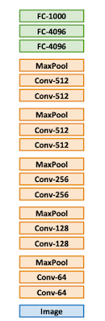
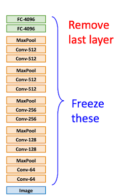

# 11 Training Neural Networks II

> [Lecture 11: Training Neural Networks II](https://youtu.be/WUazOtlti0g?si=ocuRrHezpn6Aw0ML)

> 11.5절 이후: 훈련이 끝난 후 적용할 수 있는 기법들(After training)

---

## 11.5 Model Ensembles

> [Snapshot Ensembles: Train 1, get M for free 논문(2017)](https://arxiv.org/abs/1704.00109)

**model ensembles** 기법을 통해 모델의 성능을 더 이끌어낼 수 있다. (대체로 1~2% 성능 향상을 추가로 얻을 수 있다.)

다음은 대표적인 두 가지 앙상블 기법이다.

- 방법 1: N개 independent models 학습한 뒤, 검증 시점에서 각 모델의 결과를 평균

- 방법 2: 단일 모델의 학습 과정 중 스냅샷을 여러 개 저장하고, 해당 스냅샷을 활용

  - e.g., 특정 주기를 갖는 learning rate schedule을 활용하여 스냅샷을 얻을 수 있다.

| single model snapshot ensemble | cyclic lr scheduler |
| :---: | :---: |
|  |  |

---

## 11.6 Transfer Learning with CNNs

> [DeCAF: A Deep Convolutional Activation Feature for Generic Visual Recognition 논문(2014)](https://arxiv.org/abs/1310.1531)

GPU 자원이나 데이터가 부족해도 **trasfer learning**(전이 학습)을 활용해 고성능 모델을 획득할 수 있다. 다음은 ImageNet 데이터셋으로 학습한 AlexNet의 전이학습 예시다.

> 하단이 입력부, 상단이 출력부에 해당된다.

| pretrained | transfer learning |
| :---: | :---: |
|  |  |

|  |  | note |
| :---: | --- | --- |
| (i) | class score를 계산하는 Fullt-Connected layer 삭제 | 마지막 FC-4096 레이어 출력을 feature vector로 활용한다. |
| (ii) | 새로운 데이터셋에서 fine-tuning 수행 | - 대체로 선행 학습에서 설정한 learning rate의 ~1/10 수준으로 훈련한다.  - (less data or should be faster) 기존 가중치를 동결하고, 새로운 가중치만 업데이트한다. (해당 케이스가 아니면 fine-tuning 필요) |

하지만 이때, 새로운 데이터셋과 기존 데이터셋(예시의 경우 ImageNet)의 유사성을 고려해야 한다.

| 전이학습 대상 | 기존 데이터셋과 유사 | 기존 데이터셋과 큰 차이 |
| --- | --- | --- |
| 작은 데이터셋 (10s~100s) | 출력부에 새로운 linear classifier 추가 | 여러 stages에 linear classifier를 추가해 본다. **(주의 필요)** |
| 일반적인 데이터 (100s~1000s) | few layers 대상으로 fine-tuning 수행 | 더 많은 layers를 대상으로 fine-tuning 수행 |

---

## 11.7 Distributed Training

(생략)

---

### 11.7.1 Linear Scaling Rule

> [Accurate, Large Minibatch SGD: Traning ImageNet in 1 Hour 논문(2017)](https://arxiv.org/abs/1706.02677)

> weight decay, momentum, data shuffling은 고려하지 않는다.

K개의 GPU를 사용한 분산 학습 시, **Linear Scaling Rule**에 따라 single-GPU 설정을 linear하게 늘린 값을 사용한다.

| | single-GPU | $K$ GPUs |
| :---: | :---: | :---: |
| epoch | 동일 | 동일 |
| batch size | $N$ | $KN$ |
| learning rate | $\alpha$ | $K\alpha$ |

> **Stochastic Gradient Descent**
>
> labeled train set $X$ 의 샘플 $x$ 를 대상으로, loss function $l(x,w)$ 를 최소화하는 가중치 $w$ 를 찾는다. ( label: $y$ )
>
> $$ L(w) = {{1} \over {|X|}}\sum_{x \in X}l(x,w) $$

> **Minibatch Stochastic Gradient Descent**
>
> minibatch 단위로 가중치를 업데이트한다.
>
> - batch size: $n$
>
> $$ w_{t+1} = w_t - \eta {1 \over n} \sum_{x \in \mathcal{B}} \nabla l (x, w_t) $$

다음 두 설정을 비교하여 **linear scaling rule**이 어떻게 성립하는지 살펴보자.

| | | $w_{t+k}$ update |
| --- | --- | --- |
| bs = $n$   iteration $k$ |  | $w_{t+k} = w_t - \eta {1 \over n} \sum_{j < k}\sum_{x \in \mathcal{B_j}} \nabla l (x, w_{t+j})$ |
| bs = $kn$   iteration 1 |  |  $\hat{w}_{t+1} = w_t - \hat{\eta} {1 \over kn} \sum_{j < k} \sum_{x \in \mathcal{B_j}} \nabla l (x, w_t)$ |

- 모두 동일한 최적 지점에 도달한다고 가정했을 때, $l(x, w_t) \approx l(x, w_{t+j})$ 이다.

- 따라서, $\hat{\eta} = k\eta$ **이면 두 식은 같아지게 된다.** 

---

### 11.7.2 Learning Rate Warmup

그러나 만약 GPU를 1,000대를 사용한다면, linear scaling rule에 따라 learning rate은 1000 $\times$ $\alpha$ 가 된다.

- 이처럼 큰 learning rate는, 학습 초기 손실에서 발산을 초래할 수 있다.

- 해결책: 초기 epoch에 **warmup stage**을 두어 문제를 방지한다.

> 첫 0~5000 iteartion 동안은 linear하게 learning rate을 증가시킨다.

> constant learning rate로 warmup을 수행할 수도 있다. 하지만 classification task에서는 대체로 linear한 접근이 더 좋은 성능을 보인다.

---
