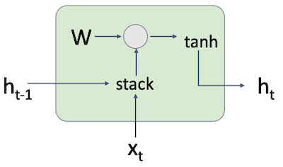
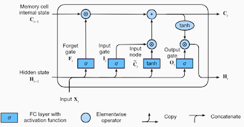
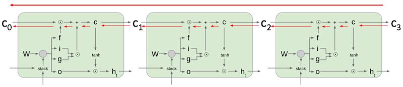

# 12 Recurrent Networks

> [Lecture 12: Recurrent Networks](https://youtu.be/dUzLD91Sj-o?si=loTvNhHKU02wEHUM)

---

## 12.1 Sequential Processing of Sequential Data

입력과 출력의 형태에 따라서 다양한 종류의 task로 분류할 수 있다.

- one to one: image classifcation

- one to many: image captioning

- many to one: video classification (input: sequence of images)

- many to many

  - machine translation

  - per-frame video classification: 입력의 각 요소에 대한 출력이 필요한 경우

---

## 12.3 Sequential Processing of Non-Sequential Data

> [DRAW: A Recurrent Neural Network For Image Generation 논문(2015)](https://arxiv.org/abs/1502.04623)

반면 non-sequential data를 sequential하게 처리하는 것도 가능하다. DRAW 논문에서는 단일 이미지 입력을 sequential하게 처리하고, 이를 역순으로 수행하면서 이미지를 생성하는 모델을 제안하였다.

---

## 12.3 Recurrent Neural Networks(RNN)

**Recurrent Neural Networks**(RNN)은 매 순간 입력 x를 받고, 출력 y를 내보낸다. 이때 vector 형태의 hidden state h를 갖는다.

$$ h_{t} = f_{w} (h_{t-1}, x_t) $$

- $f_w$ : nonlinearity

- $h_t$ : $t$ 시점의 hidden state

- $h_{t-1}$ : $t-1$ 시점의 hidden state

- $x_t$ : $t$ 시점의 input vector

예를 들어 vanilla RNN은 다음과 같은 형태를 갖는다.

$$ h_{t} = f_{w} (h_{t-1}, x_t) $$

$$ \downarrow $$

$$ h_{t} = \mathrm{tanh}(W_{hh}h_{t-1}+W_{xh}x_t) $$

$$ y_t = W_{hy}h_t $$

---

### 12.3.1 RNN Computational Graph

다음은 일반적인 RNN의 연산 그래프를 나타낸 그림이다.

- 가중치 행렬 $W$ : 모든 timp-step마다 재사용(reuse)된다.

다음은 여러 task에 따라 RNN을 변형한 연산 그래프다.

- many to many

  (1) 각 time-step마다 출력 $y_1, ..., y_T$ 를 얻는다.
  
  (2) 출력과 라벨을 비교해서 각각의 loss $L_{1} ,..., L_{T}$ 를 계산한다.

  (3) 모든 loss를 합산하여, 최종 loss $L$ 를 계산한다.

  (4) backpropagation을 수행한다.

  

- many to one

  

- one to many

  

---

## 12.4 Sequence to Sequence (seq2seq)

> [Sequence to Sequence Learning with Neural Networks 논문(2014)](https://arxiv.org/abs/1409.3215)

**Sequence to Sequence**(seq2seq)는 many to one과 one to many를 합친 형태로, 입력 시퀀스를 받아서 출력 시퀀스를 생성하는 모델이다.

- many to one: 입력 시퀀스를 하나의 벡터로 encoding

- one to many: 단일 벡터를 입력으로 받아서 출력 시퀀스를 생성한다.

이렇게 분리를 하는 이유는, 입력 토큰 수와 출력 토큰 수가 다를 수 있기 때문이다.

---

### 12.4.1 Example: Language Modeling

"hello"라는 입력 시퀀스를 학습한다고 가정하자.

- vocabulary: [h, e, l, o]

- $h_t = \mathrm{tanh}(W_{hh}h_{t-1} + W_{xh}x_t)$

이때 연산 그래프는 다음과 같다. 문자 h, e, l, l을 주면, 마지막 문자 o를 예측하는 모델이 된다.

test time에는 다음과 같이 동작한다. 매 time step은 지난 예측값을 입력으로 받아서 다음 예측값을 생성한다.

| | | |
|:---:|:---:|:---:|
|  |  |  |

이때 입력 시퀀스를 **one-hot-vector**로 encoding하는 과정이 필요하다. 다음은 one-hot encoding을 수행하는 **embedding layer**를 추가한 연산 그래프를 표현한 그래프다.

- one-hot encoding

$$ \begin{bmatrix} w_{11} & w_{12} & w_{13} & w_{14} \\ w_{21} & w_{22} & w_{23} & w_{24} \\ w_{31} & w_{32} & w_{33} & w_{34} \end{bmatrix} \begin{bmatrix} 1 \\ 0 \\ 0 \\ 0 \end{bmatrix} = \begin{bmatrix} w_{11} \\ w_{21} \\ w_{31} \end{bmatrix} $$

---

## 12.5 Truncated Backpropagation Through Time

하지만 모델의 입력 시퀀스가 길다면, backpropagation을 위해 메모리에 유지해야 하는 정보가 많아진다. 이러한 문제를 해결하기 위해, chunk 단위로 입력 시퀀스를 나누어서 처리하는 **Truncated Backpropagation Through Time**(TBPTT)가 등장했다.

다음은 시퀀스를 chunk 단위로 backpropagation을 수행하며 update하는 예시다.

| chunk 1 | chunk 2 | ... |
| :---: | :---: | :---: |
|  |  | ... |

---

## 12.6 Searching for Interpretable Hidden Units

> [Visualizing and Understanding Recurrent Networks 논문(2015)](https://arxiv.org/abs/1506.02078)

(생략)

---

## 12.7 Image Captioning with RNN

> [Show and Tell: A Neural Image Caption Generator 논문(2014)](https://arxiv.org/abs/1411.4555)

(생략)

---

## 12.8 Vanilla RNN Gradient Flow

다음은 RNN의 forward pass를 나타내는 연산 그래프다.

> $h_{t-1}$ , $x_t$ 를 concate한 뒤, 가중치 행렬 $W$ 를 곱한다. 

$$ h_t = \mathrm{tanh}(W_{hh}h_{t-1} + W_{xh}x_t) $$

$$ = \mathrm{tanh} \left( (W_{hh} \, W_{hx}) \begin{pmatrix} h_{t-1} \\ x_t \end{pmatrix} \right) $$

$$ = \mathrm{tanh} \left( W \begin{pmatrix} h_{t-1} \\ x_t \end{pmatrix} \right) $$

이제 backpropagation을 생각해보자. 예를 들어 위 예시에서는 $W_{hh}^{T}$ 를 곱해서 $h_{t-1}$ 의 gradient를 계산하게 된다. 이때 모든 time-step에서 $W_{hh}^{T}$ 가 누적되면서, 둘 중 하나의 문제가 발생할 수 있다.

- largest singular value > 1

  - gradient explosion이 발생한다.

  - **gradient clipping**을 통해 해결할 수 있다.

- largest singular value < 1

  - gradient vanishing이 발생한다.

  - RNN의 구조를 바꿔서 해결할 수 있다.

---

## 12.9 Long Short-Term Memory (LSTM)

> [Long Short Term Memory 논문(1997)](https://www.bioinf.jku.at/publications/older/2604.pdf)

> [DIVE INTO DEEP LEARNING: 10.1. Long Short-Term Memory (LSTM)](https://d2l.ai/chapter_recurrent-modern/lstm.html)

**Long Short-Term Memory**(LSTM)은 RNN에서 발생하는 gradient vanishing를 해결하기 위해 제안된 모델이다. LSTM은 $i, f, o, g$ 4개 gate를 기반으로, 매 time steps마다 cell state, hidden state의 두 가지 state를 두는 방식으로 문제를 해결한다.

> ResNet의 residual connection 비슷한 해결 방식이다.

- 우선 vanilla RNN처럼 input과 이전 hidden state를 concat하여 가중치 행렬과 곱한다.

- 행렬 연산 결과를, gate를 거쳐 크기가 $h$ 인 벡터 4개로 분리한다.

  - sigmoid $\sigma$ : [0, 1]. 0에 가까울수록 과거 정보를 잊는다.

$$ \begin{pmatrix} i \\ f \\ o \\ g \end{pmatrix} = \begin{pmatrix} \sigma \\ \sigma \\ \sigma \\ \mathrm{tanh} \end{pmatrix} W \begin{pmatrix} h_{t-1} \\ x_t \end{pmatrix} $$

다음은 LSTM 연산을 순차적으로 나타낸 그림이다.

| | |
| :---: | :---: |
|  |  | 
|  |  |

- **cell state** $c_t$

$$c_t = f \odot c_{t-1} + i \odot g$$

- **hidden state** $h_t$
 
$$h_t = o \odot \mathrm{tanh}(c_t)$$

복잡해 보이지만 LSTM의 backpropagation 과정은, 이러한 gate에 interrupt되지 않고 highway를 따라서 진행된다.

$$ g = T(x, W_{T}) $$

$$ y = g \odot H(x, W_{H}) + (1-g) \odot x $$

---

## 12.10 Multilayer RNNs

RNN은 여러 층으로 쌓을 수 있다. 이때 각 층의 hidden state가, 다음 층의 input으로 사용된다.

- One-Layer RNN

  

- Two-Layer RNN

  

- Three-Layer RNN

  

---

## 12.11 Other RNN Variants

(생략)

---