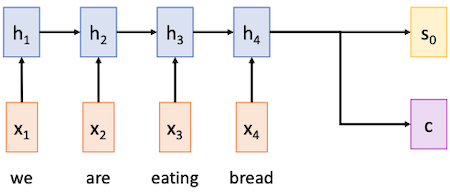
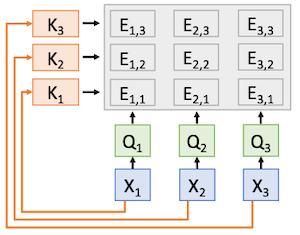

# 13 Attention

> [Lecture 13: Attention](https://youtu.be/YAgjfMR9R_M?si=rpSSnKo8ZrxDVwJB)

---

## 13.1 Sequence-to-Sequence with RNNs

> [Neural Machine Translation by Jointly Learning to Align and Translate 논문(2015)](https://arxiv.org/abs/1409.0473)

앞서 RNN을 활용한 Seq2Seq 모델을 살펴보았다. 이제 영어로 된 입력 시퀀스를 스페인어 출력 시퀀스로 번역하는 예시를 모듈별로 살펴보자.


- 입력 시퀀스(영어): $x_1, \cdots x_{\mathsf{T}}$

- 출력 시퀀스(스페인어): $y_1, \cdots y_{\mathsf{T}}$

---

### 13.1.1 Encoder

**Encoder**는 최종 hidden state를 바탕으로 (1) decoder의 **initial state** $s_0$ 와, (2) 지금까지의 입력 시퀀스의 정보가 담긴 **context vector** $c$ 를 출력한다.



$$ h_{\mathsf{t}} = f_w(x_{t}, h_{t-1}) $$

- **initial decoder state** $s_0$

  encoder의 final hidden state가, decoder의 initial hidden state로 사용한다.

- **context vector** $c$

  decoder가 문장을 만들기 위해 필요한 정보를 담고 있다.

  - 입력 시퀀스의 모든 정보가, 하나의 고정된 크기의 벡터로 encoding된다.

  - $c=h_{\mathsf{T}}$ 로 두는 경우도 많다.

---

### 13.1.2 Decoder

**Decoder**는 앞서 encoder에게 전달받은 정보를 바탕으로, 순차적으로 출력 시퀀스를 만들어낸다.


$$ s_t = g_{\mathsf{U}}(y_{t-1}, h_{t-1}, c) $$

하지만 이러한 Encoder-Decoder 모델은, 입력 시퀀스가 길어질수록 문제가 발생한다.

- (-) 문단, 책 단위의 입력 시퀀스를 단일 context vector $c$ 에 담기는 어렵다. (**bottleneck**)

- (-) RNN의 gradient vanishing/exploding 문제가 심화된다.

---

## 13.2 Sequence-to-Sequence with RNNs and Attention

> [Neural Machine Translation by Jointly Learning to Align and Translate 논문(2014)](https://arxiv.org/abs/1409.0473)

이러한 문제의 해결책으로 **Attention Mechanism**이 제안되었다.

- idea

  - output sentence 내 단어는 입력의 특정 단어나 sequence와 관련이 있다. 

    > 위 번역 예시에서, "estamos"는 "we are"과 대응된다.

  - 따라서 특정한 입력 단어가, 특정한 출력 단어에 attention하는 방법을 고려할 수 있다.

---

### 13.2.1 Encoder and Attention

본래 encoder에서 final hidden state만 사용했지만, attention 기반의 접근에서는 모든 time step에서의 hidden state를 사용한다.

1. **alignment scores**

    initial decoder state(final hidden state) $s_0$ 와, hidden state $h_i$ 를 attention 모델(MLP)의 입력으로 하여 **alignment scores**를 구한다.

    

    > $s_0$ 와 $h_1$ 을 연산한 결과가 $e_{11}$ 이 된다.

    > $f_{att}$ : MLP

$$ e_{t,i} = f_{att}(s_{t-1}, h_i) $$


2. **alignment weights**

    alignment score를 softmax를 이용해 normalize하여, 확률 벡터 형태의 **alignment weights**를 구한다.

    

    - $0 < a_{t,i} < 1$

    - $\sum_{i} a_{t,i} = 1$

3. **context vector**

    alignment weights $a_{t,i}$ 와 hidden state $h_{i}$ 의 linear combination으로 **context vector** $c_t$ 를 구한다.

    

    > $c_t$ 는 $h_1, \cdots, h_{\mathsf{T}}$ 의 weighted sum이다.

```math
c_t = \sum_{i} a_{t,i}h_{i}
```

---

### 13.2.2 Decoder and Attention

앞서 context vector는, encoder의 각 hidden state에 얼마나 가중치를 줄지를 판단하고, 모든 hidden state를 weighted sum하여 구했다.

4. contect vector $c_1$ 와 [START] token $y_0$ 를 바탕으로 출력 시퀀스를 생성한다.

    

    > 이때 "estamos"는 "we are"에 attention한다. 예를 들어 $a_{11}=a_{12}=0.45, a_{13}=a_{14}=0.05$ 와 같은 값을 가질 것이다. 

$$ s_t = g_{\mathsf{U}}(y_{t-1}, h_{t-1}, c_t) $$

5. decoder의 hidden state $s_1$ 를 encoder의 hidden state와 연산하여, 새롭게 얻은 context vector $c_2$ 를 바탕으로 출력을 구한다.

    

6. 과정을 반복하여 출력 시퀀스를 생성한다.

    

이처럼 매 time step마다 decoder가 다른 context vector를 가지면서 다음과 같은 특징을 갖게 된다.

- (+) 모든 입력 시퀀스가 하나의 context vector에 담기지 않아도 된다. (bottleneck 해결)

- (+) decoder는 매 time step마다 입력 시퀀스의 특정 부분에 attention한다.

---

## 13.3 Image Captioning with RNNs and Attention

> [Show, Attend and Tell: Neural Image Caption Generation with Visual Attention 논문(2015)](https://arxiv.org/abs/1502.03044)

이러한 attention은 sequence에 국한되지 않고, 이미지를 언어로 설명하는 **Image Captioning** 작업에서도 사용할 수 있다.

1. convolution 연산을 통해, 입력 이미지의 **feature vector**를 추출한다.

    이때 각 grid를, 이미지의 spatial position에 대응시킬 수 있다.

    

2. initial decoder state(final hidden state) $s_{0}$ 와, grid $h_{i,j}$ 를 MLP의 입력으로 주어 attention score를 획득한다.

    

$$ e_{t,i,j} = f_{att}(s_{t-1}, h_{i,j}) $$

3. softmax 함수를 이용해 attention weights를 계산한다.

    

$$ a_{t,:,:} = \mathrm{softmax}(e_{t,:,:}) $$

4. attention weights를 바탕으로 context vector를 계산한다. context vector $c_t$ 와 [START] token $y_0$ 를 바탕으로 출력을 생성한다.

    

$$ c_t = \sum_{i,j} a_{t,i,j}h_{i,j} $$

5. 과정을 반복하여 출력 시퀀스를 생성한다.

    

다음은 시퀀스에 따른 attention을 시각화한 예시이다.


---

## 13.4 Attention Layer

이러한 Attention Mechanism을 조금만 변형하면, **Attention Layer**로 일반화할 수 있다.

---

### 13.4.1 Use dot product as similarity

앞서 similarity function으로 사용한 MLP 모델 대신, dot product을 사용하면 보다 효율적으로 similarity를 계산할 수 있다.

- inputs

  - Query Vector: $q$ ( shape: $D_Q$ )

    > Decoder의 hidden state $s_{t-1}$ 에 해당된다.

  - Input Vectors: $X$ ( shape: $N_X \times D_Q$ )

    > Encoder의 hidden state collection $h_{i,j}$ 에 해당된다.

  - Similarity Function

    - $f_{att}$

    - **dot product** (change 1: 단순하며 잘 작동)

    - **scaled dot product** (change 2: gradient vanishing 방지)

위와 같은 입력에서는 다음과 같은 연산이 수행된다.

- Computation

  - Similarities
  
    - $f_{att}$ : $e_i = f_{att}(q, X_i)$
    
    - **dot product**: $e_i = q \cdot X_i$

    - **scaled dot product**: $e_i = {q \cdot X_i}/{\sqrt{D_Q}}$

  - Attention Weights: $a_i = \mathrm{softmax}(e_i)$ ( Shape : $N_X$ )

  - Output Vector: $y = \sum_{i} a_i X_i$ ( Shape : $D_X$ )

---

### 13.4.2 Multiple query vectors

이전까지는 decoder가 하나의 query를 사용했지만, 하지만 행렬 연산 형태로 한번에 여러 개의 query를 사용할 수 있다.

- inputs

  - **Query Vector**: $Q$ ( shape: $N_Q \times D_Q$ )

  - Input Vectors: $X$ ( shape: $N_X \times D_Q$ )

- Computation

  - **Similarities**: $E_{i,j} = {Q_i \cdot X_i}/{\sqrt{D_Q}}$ ( Shape: $N_Q \times N_X$ )

  - Attention Weights: $A = \mathrm{softmax}(E, \mathrm{dim}=1)$ ( Shape : $N_Q \times N_X$ )

  - Output Vector: $Y_i = \sum_{j} A_{i,j} X_i$ ( Shape : $D_X$ )

---

### 13.4.3 Separate key and value

더 나아가 input vector를, 학습 가능한 key matrix과 value matrix를 두어, key vector와 value vector로 분리할 수 있다.

> 검색 엔진의 동작 원리와 유사하다. 예를 들어 유튜브에 어떤 동영상을 검색하면, (1) 검색 엔진은 내가 입력한 텍스트(query)에 대해, 동영상의 제목, 설명, 태그 등(key)과 유사도를 계산한다. (similarity)

> (2) query와 key의 유사도를 계산한 후, 대응되는 동영상 목록(value)을 바탕으로 output을 생성한다. (output vector)

key와 value를 분리한 경우, 수식은 다음과 같다.

- inputs

  - Query Vector: $Q$ ( shape: $N_Q \times D_Q$ )

  - Input Vectors: $X$ ( shape: $N_X \times D_X$ )

  - **Key Matrix**: $W_K$ ( shape: $D_X \times D_Q$ )

  - **Value Matrix**: $W_V$ ( shape: $D_X \times D_V$ )

- Computation

  - **Key Vectors**: $K_i = X_i W_K$ ( Shape : $N_X \times D_Q$ )
  
  - **Value Vectors**: $V_i = X_i W_V$ ( Shape : $N_X \times D_V$ )

  - Similarities: $E_{i,j} = {Q_i \cdot K_j}/{\sqrt{D_Q}}$ ( Shape: $N_Q \times N_X$ )

  - Attention Weights: $A = \mathrm{softmax}(E, \mathrm{dim}=1)$ ( Shape : $N_Q \times N_X$ )

  - Output Vector: $Y_i = \sum_{j} A_{i,j} V_j$ ( Shape : $N_Q \times D_V$ )

---

### 13.4.4 Computational Graph of Attention Layer

Attention Layer를 단계별로 시각화한 그림을 살펴보자.

0. Input Vectors, Query Vectors

    

1. **Key Vectors**: Input Vector에 Key Matrix를 곱하여 Key Vectors를 구한다.

    

3. **Similarities**: Key Vector와 Query Vector의 scaled dot product 연산을 통해 Similarities를 구한다.

    

4. **Attention Weights**: Similarities에 softmax를 이용한 normalization 과정을 거쳐 Attention Weights를 구한다.

    

5. **Value Vector**: Input Vector와 Value Matrix를 곱하여 Value Vector를 구한다.

    

6. **Output Vector**: Attention Weights와 Value Vector의 weighted sum을 통해 Output Vector를 구한다.

    

---

## 13.5 Self-Attention Layer

다음은 Attention Layer의 변형 중 하나인 **Self-Attention Layer**이다. self-attention layer에서는 하나의 input vector마다 하나의 query vector가 대응된다.

- inputs

  - Input Vectors: $X$ ( shape: $N_X \times D_X$ )

  - Key Matrix: $W_K$ ( shape: $D_X \times D_Q$ )

  - Value Matrix: $W_V$ ( shape: $D_X \times D_V$ )

  - **Query Matrix**: $W_Q$ ( shape: $D_X \times D_Q$ )

- Computation

  - **Query Vectors**: $Q = X W_{Q}$
  
  - Key Vectors: $K_i = X_i W_K$ ( Shape : $N_X \times D_Q$ )
  
  - Value Vectors: $V_i = X_i W_V$ ( Shape : $N_X \times D_V$ )

  - Similarities: $E_{i,j} = {Q_i \cdot K_j}/{\sqrt{D_Q}}$ ( Shape: $N_Q \times N_X$ )

  - Attention Weights: $A = \mathrm{softmax}(E, \mathrm{dim}=1)$ ( Shape : $N_Q \times N_X$ )

  - Output Vector: $Y_i = \sum_{j} A_{i,j} V_j$ ( Shape : $N_Q \times D_V$ )

Self-Attention Layer를 단계별로 살펴보자.

0. Input Vector

    

1. **Query Vector**: Input Vector에 Query Matrix를 곱하여 Query Vector를 구한다.

    

2. **Key Vector**: Input Vector에 Key Matrix를 곱하여 Key Vector를 구한다.

    

3. **Similarities**: Key Vector와 Query Vector의 scaled dot product 연산을 통해 Similarities를 구한다.

    

4. **Attention Weights**: Similarities에 softmax 함수를 적용하여 Attention Weights를 구한다.

    

5. **Value Vector**: Input Vector와 Value Matrix를 곱하여 Value Vector를 구한다.

    

6. **Output Vector**: Attention Weights와 Value Vector의 weighted sum을 통해 Output Vector를 구한다.

    

---

### 13.5.1 Permutation Equivariance

Self-Attention Layer는 입력의 순서를 바꾸면, 출력도 동일하게 순서가 바뀌는 특징을 갖는다. (**permutation equivariance**) 다시 말해 입력 시퀀스의 순서에 무관하게 동일한 출력을 내놓는다.

> permutation equivariant: $f(g(x)) = g(f(x))$


이때 벡터의 순서를 보존해야 할 필요가 있다면, 위치 정보를 포함하도록 **positional encoding** 과정을 추가한다.

> positional encoding E: lookup table이나 fixed function으로 구현할 수 있다.


---

## 13.6 Masked Self-Attention Layer

또 다른 attention layer의 변형으로, language modeling에서 흔히 사용하는 **Masked Self-Attention Layer**가 있다. 

- 입력 벡터가 다음 시퀀스를 참조(look ahead)하는 것을 막고, 오직 과거의 정보만 attention하도록 제한한다.

- 제한할 시퀀스의 similarity를 $-\infty$ 로 둔다.(softmax를 적용 시 값은 0이 된다.)


아래와 같이 다음 단어에 attention을 강제하기 위한 language modeling 예시에서 유용하다.


---

## 13.7 Multihead Self-Attention Layer

다음은 H개의 independent한 attention head를 사용하는 **Multihead Self-Attention Layer**이다. 

> 차원이 D인 Input Vector $X$ 가 있다고 하면, 차원을 H개의 chunk로 분할한 뒤 병렬로 각 레이어의 입력으로 사용한다. 이후 각 레이어의 출력을 concat하여 차원을 D로 복원한다.

Multihead Self-Attention Layer에서는 두 하이퍼패러미터를 추가로 지정한다.

- Query dimension $D_Q$

- Number of heads $H$

1. 각 input vector를 head 개수 $H$ 만큼 분할한다.

    

    

2. 분할한 vector를 각 head의 입력으로 사용하여 출력을 얻는다.

    

    

3. 각 head의 출력을 concat하여 차원을 D로 복원한다.

    

    

---

## 13.8 Example: CNN with Self-Attention

> [Self-Attention Generative Adversarial Networks 논문(2018)](https://arxiv.org/abs/1805.08318)

다음은 CNN과 self-attention을 결합한 예시다.


1. 각기 다른 세 가지 1x1 convolution layer를 통해, grid마다의 Query, Key, Value vector를 구한다.

2. Query와 Key Vector의 dot product를 통해 Similarity를 구한 뒤, softmax를 적용하여 Attention Weights를 구한다.

3. Attention Weights와 Value Vector의 weighted sum을 통해 Output Vector를 구한다.

4. 추가로 1x1 convolution layer를 통해, Output Vector의 차원을 원래의 차원으로 복원한 뒤, residual connection을 적용한다.


---

## 13.9 Three Ways of Processing Sequences

지금까지의 sequence processing을 위한 모델 기법을 비교해 보자.

- Recurrent Neural Network

  **ordered sequence** 처리를 위해 사용할 수 있다.

  

  - (+) 긴 시퀀스에서도 잘 동작한다. ( $h_{\mathsf{T}}$ 가 모든 입력 시퀀스의 정보를 담고 있다.)

  - (-) 병렬화가 어렵다. (hidden state를 순차적으로 구해야 하므로)

- 1D Convolution

  **multidimensional grid** 처리를 위해 사용할 수 있다.

  

  - (+) 병렬화가 쉽다.

  - (-) 긴 시퀀스 처리가 어렵다. (모든 입력 시퀀스 정보를 stack하기 위해서는, 엄청나게 많은 convolution layer가 필요하다.)

- Self-Attention

  **sets of vector** 처리를 위해 사용할 수 있다.

  

  - (+) 병렬화가 쉽다.

  - (+) 긴 시퀀스에서도 잘 동작한다.

  - (-) 굉장히 memory intensive한 연산이다.

---

## 13.10 Transformer

> [Attention Is All You Need 논문(2017)](https://arxiv.org/abs/1706.03762)

**Transformer** 모델은 오로지 self-attention layer만을 사용하여, sequence processing을 수행한다. 두 가지 주된 특징을 갖는다.

- (+) highly scalabilable

- (+) highly parallelizable

---

### 13.10.1 Transformer Block

다음은 **transformer block**을 과정에 따라 순차적으로 나타낸 그림이다.

1. 모든 input vector x를 (Multihead) self-attention layer의 입력으로 사용한다.

    > self-attention은 오로지 input vector 사이의 interaction만을 고려한다.

    

2. residual connection을 적용한다.

    

3. 각 벡터마다 independent하게 Layer Normalization을 적용한다.
    
    > CNN에서는 Batch Normalization을 주로 사용하는데, 시퀀스 입력을 처리하는 Transformer에서는 Layer Normalization가 보다 유용하다.

    

4. (Fully Connected Layer) 각 벡터마다 independent하게 MLP를 적용한다.

    

5. residual connection을 적용한다.

    

6. 각 벡터마다 independent하게 Layer Normalization을 적용한 뒤, 출력 벡터 y를 얻는다.

    

---

### 13.10.2 Pre-Norm Transformer Block

> [Adaptive Input Representations for Neural Language Modeling 논문(2018)](https://arxiv.org/abs/1809.10853)

layer normalization을 residual connection 이전에 적용하는 **pre-norm transformer block** 구조(Pre-LN)도 있다. 

> 초기 gradient의 scale이 줄어들어, Post-LN transformer 모델보다 안정적으로 학습할 수 있다.


---

### 13.10.3 Transformer Model

Transformer 모델은 이러한 transformer block을 여러 개 쌓아올린 형태로 구성된다. 

- Attention is All You Need 논문(Vaswani et al)

  - Encoder: 6 blocks, D=512, 6 heads

  - Decoder: 6 blocks, D=512, 6 heads

---

## 13.11 Transformer: Transfer Learning

> [BERT: Pre-training of Deep Bidirectional Transformers for Language Understanding 논문(2018)](https://arxiv.org/abs/1810.04805)

CV 도메인에서 ImageNet으로 pre-training한 모델을 다른 task에서 사용하기 위해 fine-tuning하는 것처럼, NLP 도메인에서도 다양한 downstream task에 적용할 수 있는 Transformer-based Language Model이 있다.

- Pretraining

  인터넷에서 수집한 대량의 텍스트 데이터를 바탕으로, 거대한 Transformer-based Language Model을 pre-training한다.

- Finetuning

  내 task에 맞게 pre-trained model를 수정한 뒤, fine-tuning한다.

---

## 13.12 Scaling Up Transformer

> [Scaling Language Models: Methods, Analysis, & Insights from Training Gopher 논문(2021)](https://arxiv.org/abs/2112.11446)

다음은 다양한 크기의 Transformer-based 모델을 비교한 표이다.


---